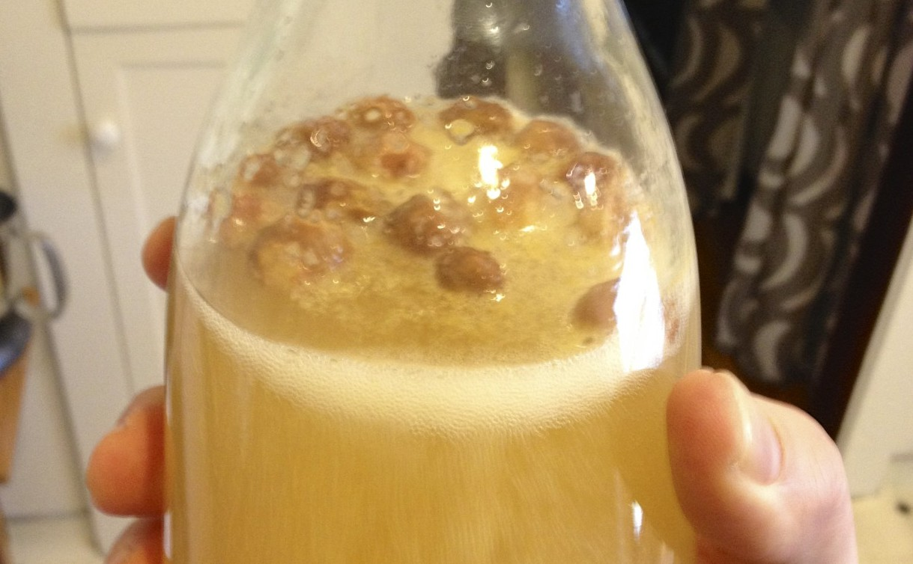

+++
title = "Sima #1: Update #1"
date = 2014-01-04

[taxonomies]
drink_types = ["mead"]
tags = ["lemon", "sima", "sima #1"]
post_types = ["update"]
+++

I’m not sure how fermentation progresses, so I’ve been popping the flip-top every so often and
checking on it (and tasting!). I guess, due to the bubbles, all is going well! Since I don’t want
the carbonation to die, I added some more sugar to the bottle (didn’t really measure...).

Day 4

And live action fermentation! You can actually hear the bubbling there if you turn up your volume
enough…
