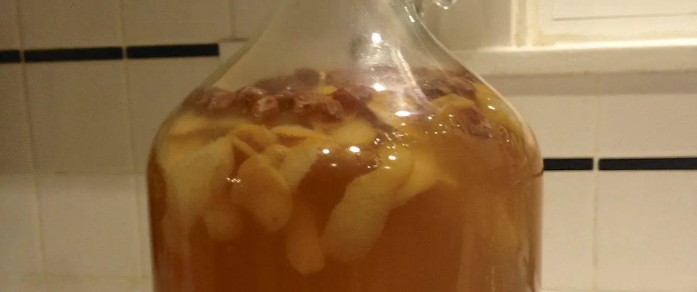
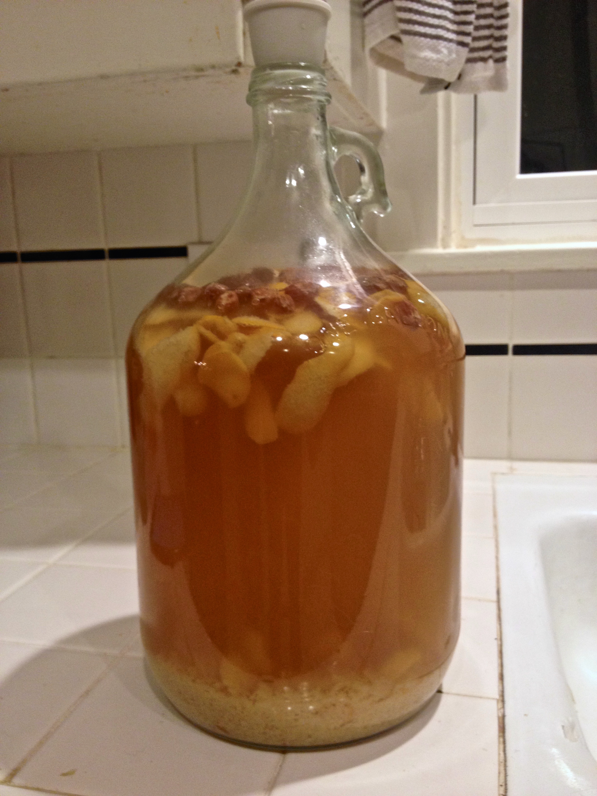
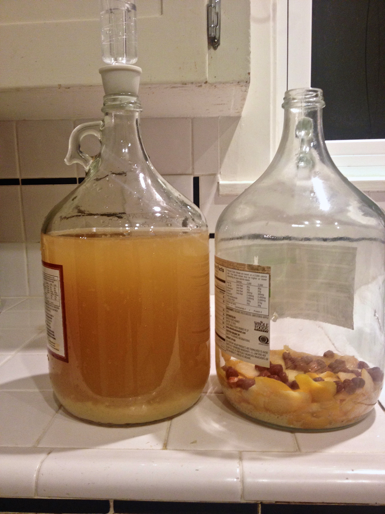

+++
title = "Meyer Lemon Melomel #1: Update 8"
date = 2014-01-26

[taxonomies]
drink_types = ["mead"]
tags = ["lemon", "meyer lemon melomel #1"]
post_types = ["update"]
+++

Bubbling at 1:10 still (that seems weird). Racked to 2nd carboy using OG water siphon (pretty well
sanitized I think); looks like I transferred over some sediment, but almost all the lemon and old
raisins didn’t transfer. After fully siphoned, I realized I forgot to get a gravity reading, so
transferred some back into the same carafe I used the first time: `1.007 @ 68F` (adjusted for temp,
that’s `1.008`), then funneled (KMeta’ed the funnel) back into the new carboy, leaving a few sips to
taste. Didn’t sanitize the temp probe or the carafe. :-/. Tastes like very little yeast, but big
lemon and honey flavors (not off-putting to me…), so I added some fresh raisins to the 2nd
fermentation. Bunged and airlocked with tap water and KMeta.

Before the rack:

After the rack:

