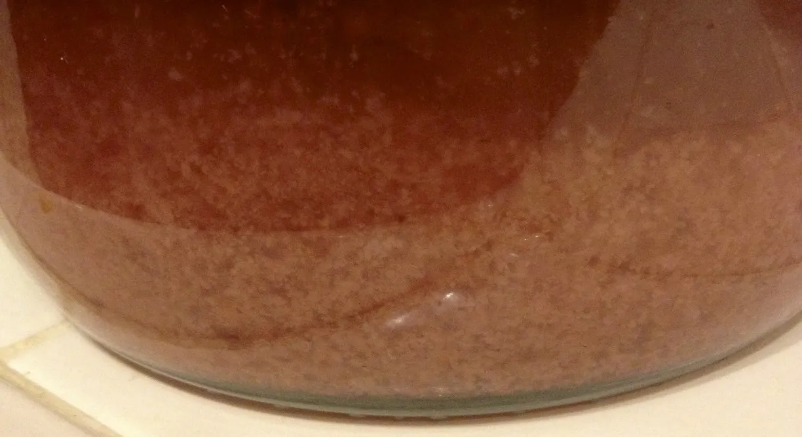
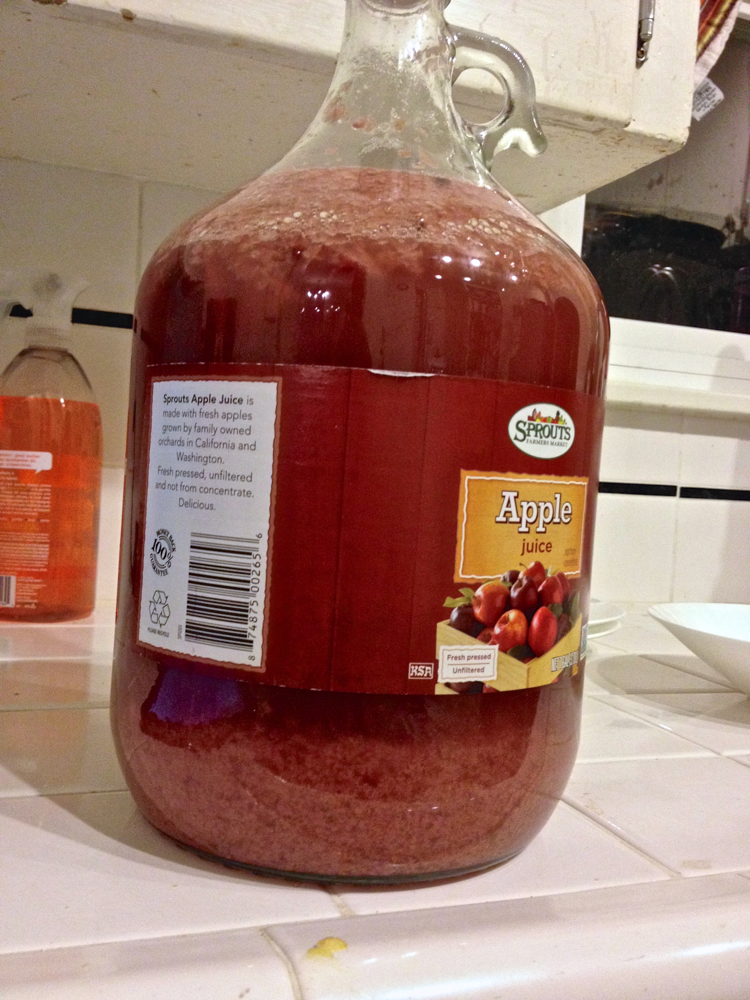
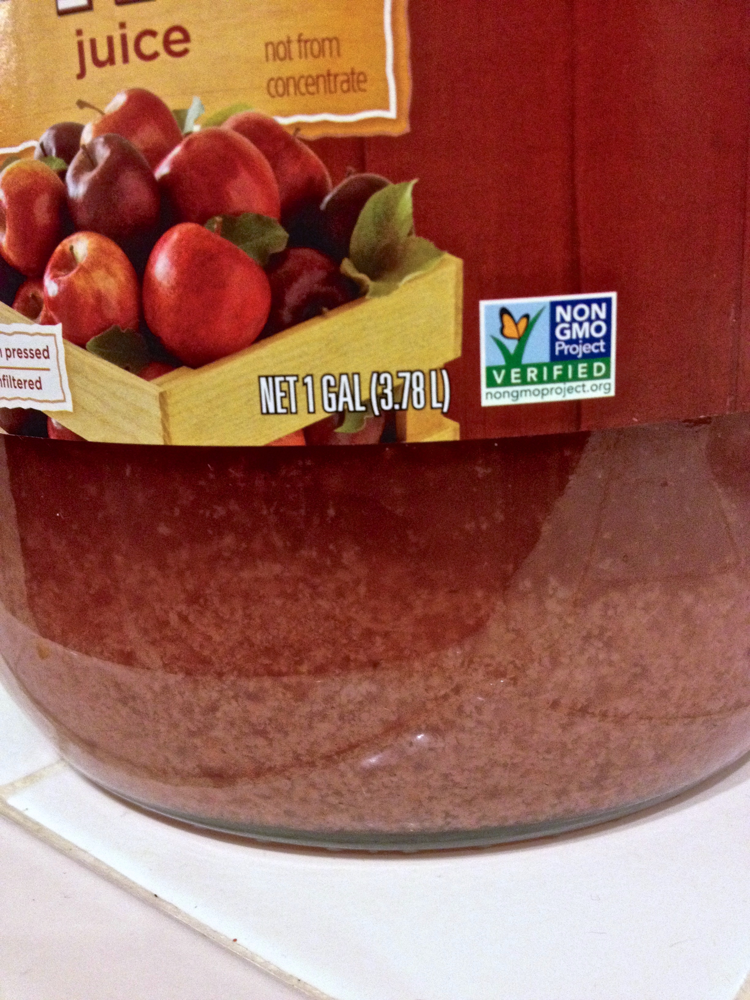

+++
title = "Blackberry Pear Melomel #1: Update 2"
date = 2014-02-04

[taxonomies]
drink_types = ["mead"]
tags = ["blackberry", "pear", "melomel", "blackberry pear melomel #1"]
post_types = ["update"]
+++

So much fruit!

Just look at it!

