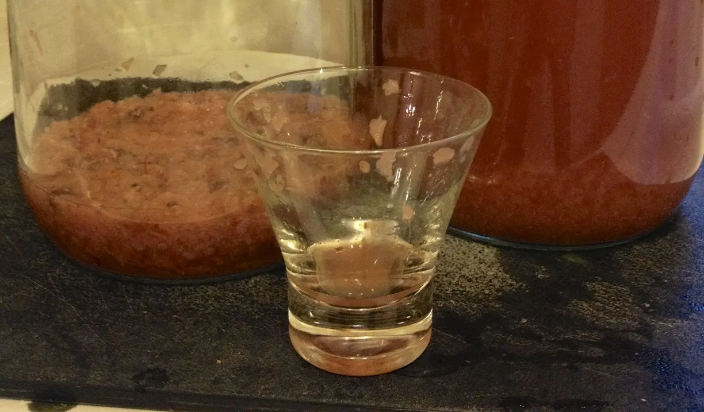
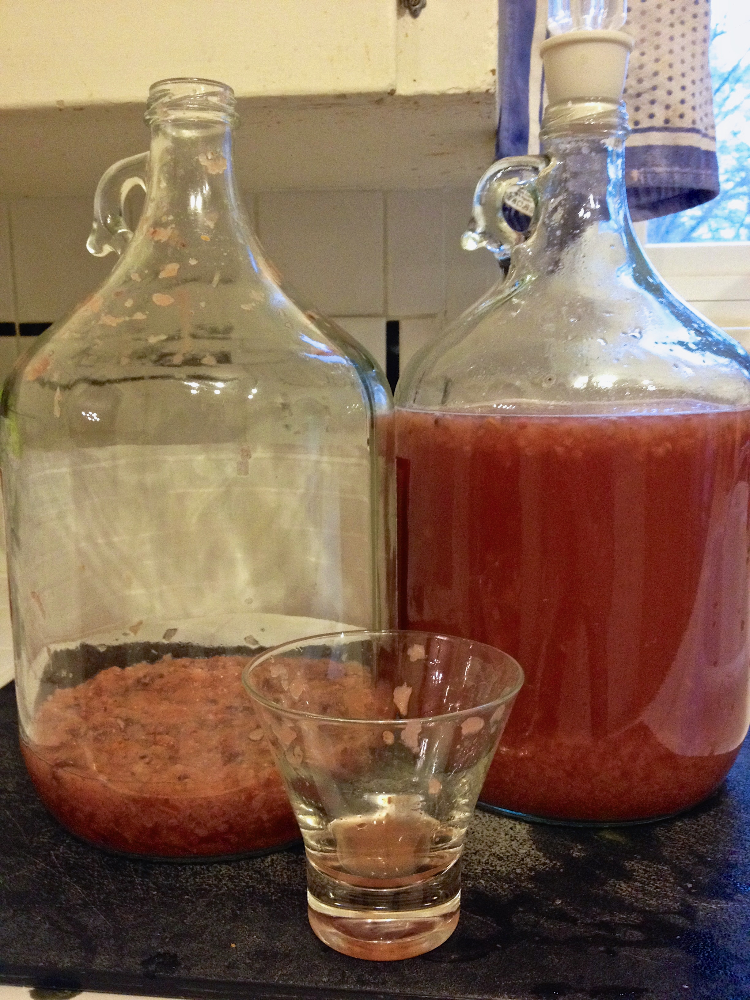

+++
title = "Blackberry Pear Melomel #1: Update 5"
date = 2014-02-08

[taxonomies]
drink_types = ["mead"]
tags = ["blackberry", "pear", "melomel", "blackberry pear melomel #1"]
post_types = ["update"]
+++

Racked off the fruit. SG at `1.046`. Washed bung and airlock and put on the new carboy. Liquid is
now only up to where the top of the carboy starts to curve. Still about 1/2″ of fruit on the top,
but looks pretty liquidy.

