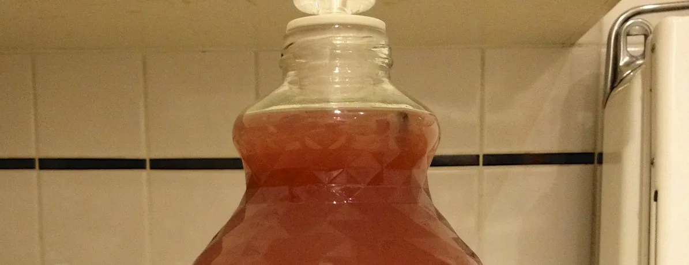
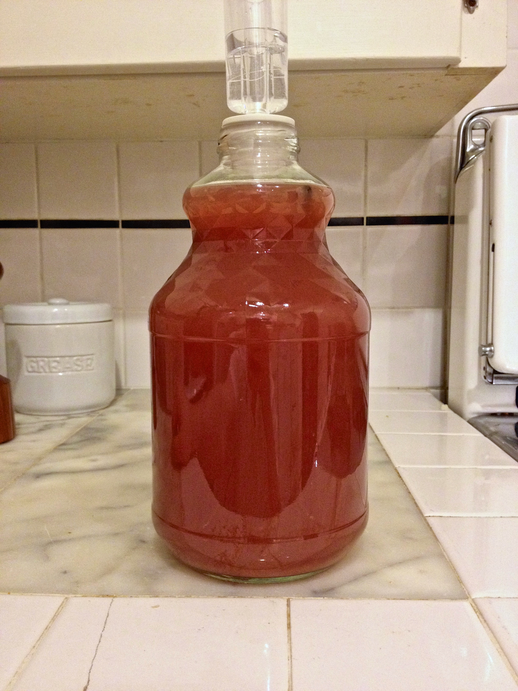

+++
title = "Blackberry Pear Melomel #1: Update 14"
date = 2014-02-20

[taxonomies]
drink_types = ["mead"]
tags = ["blackberry", "pear", "melomel", "blackberry pear melomel #1"]
post_types = ["update"]
+++

Racked, but decided to use a 2L bottle instead of a 1G carboy so as to reduce the amount of
headspace. the bung didn’t really fit too well, so after I took the pic, I wrapped it with some
[Glad Press ‘N’ Seal](http://www.glad.com/food-storage/plastic-wrap/press-n-seal/) to keep as much
oxygen out as possible.

Secondary. 1 vanilla bean, split but didn’t clear seeds out; cut off top. SG: `1.003`. pH: `~3.8`.
Bottled in a 2Q bottle, so barely any room in there for oxygen. Looks like I still managed to
transfer some sediment; maybe 1/4-1/2″. :-/ Sucks cause I’ll probably need to rack again before
bottling now, which means I lose the long vanilla bean time. Anyway… It’s _really_ hazy; not clear
at all.
