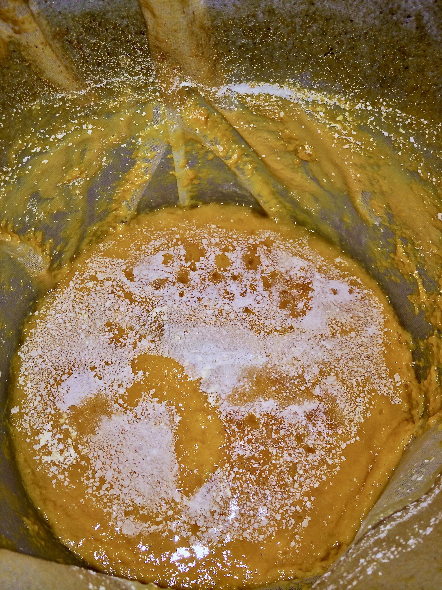
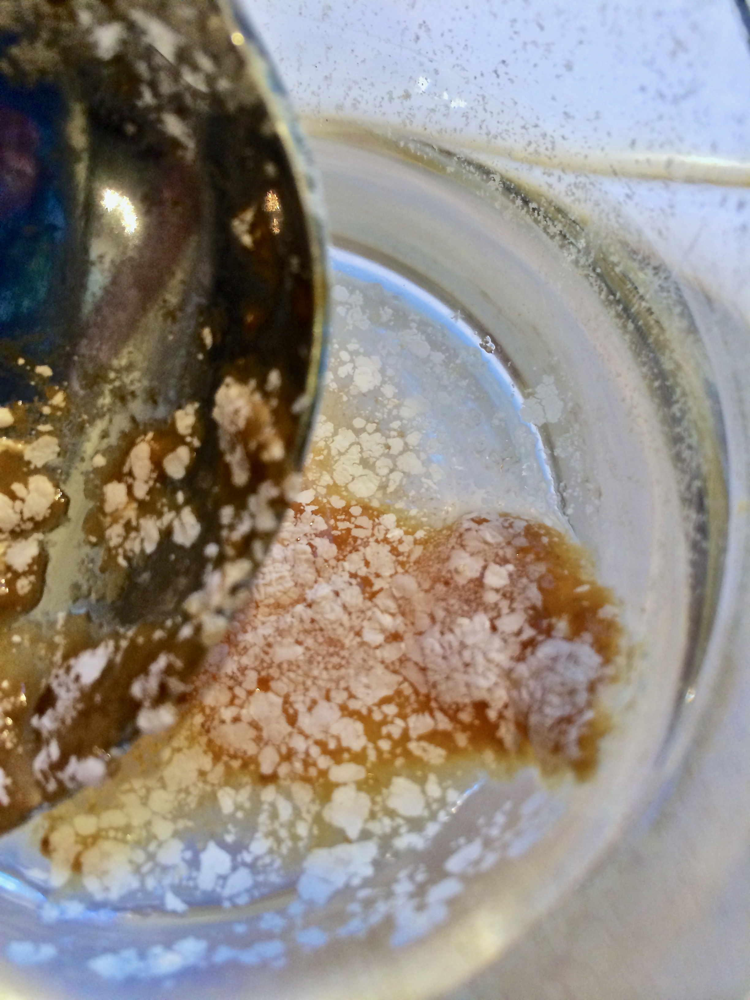

+++
title = "Nectarine Cider #1: Update 3"
date = 2014-06-28

[taxonomies]
drink_types = ["cider"]
tags = ["nectarine cider #1"]
post_types = ["update"]
+++

Racked to carboy. Serious white film on top of the cap. Mixed consistency–the first and last 1/2Gs
were thin, the rest pretty thick.

