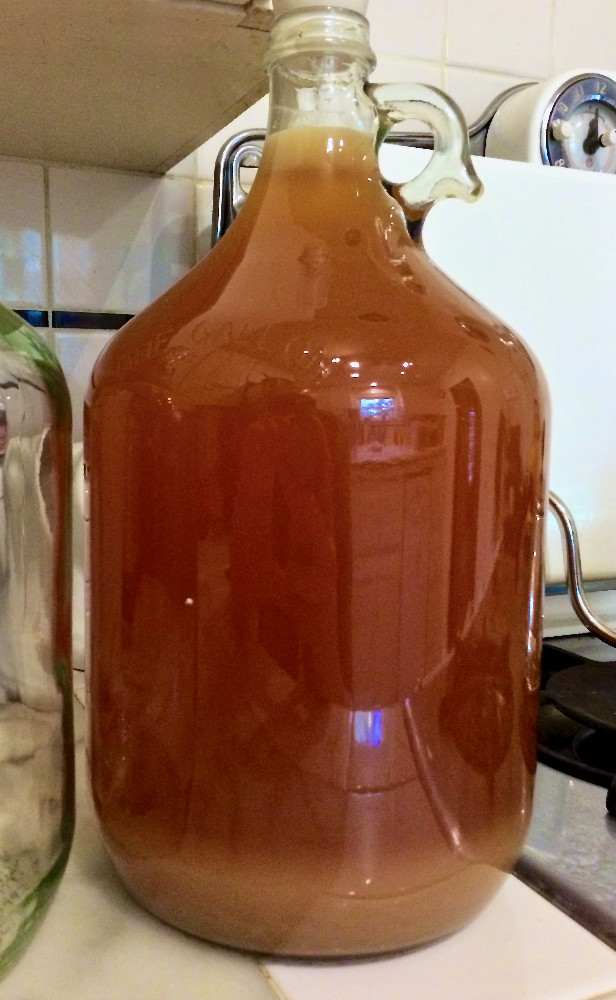
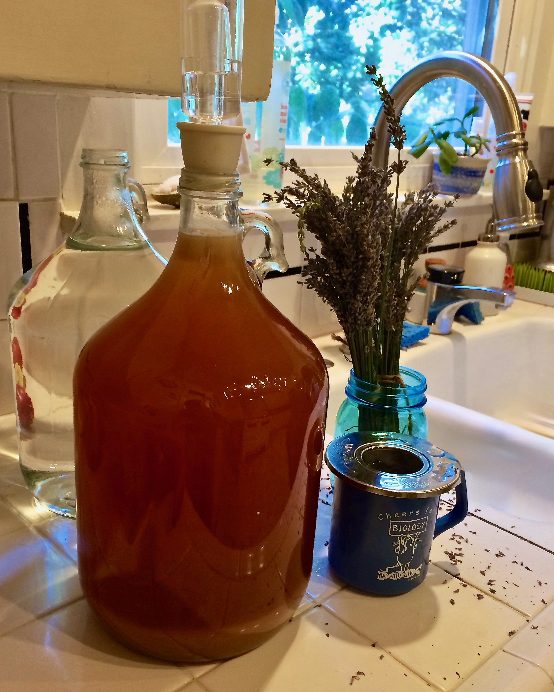

+++
title = "Strawberry Lavender Melomel #1: Update 12"
date = 2014-06-28

[taxonomies]
drink_types = ["mead"]
tags = ["strawberry lavender melomel #1"]
post_types = ["update"]
+++

Steeped a coffee mug of water and a couple grams of dried lavender for about 15 minutes.

