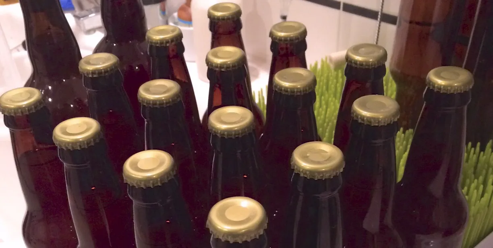
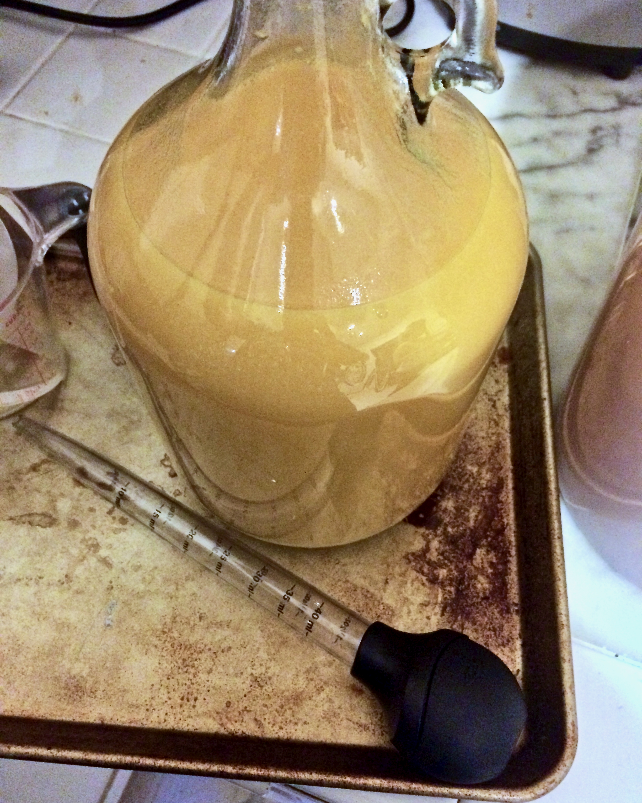
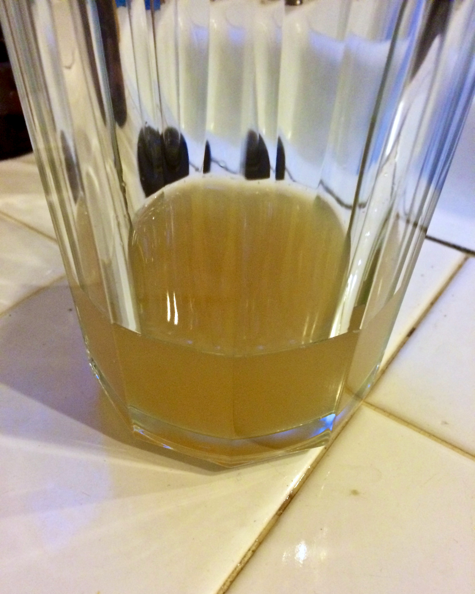
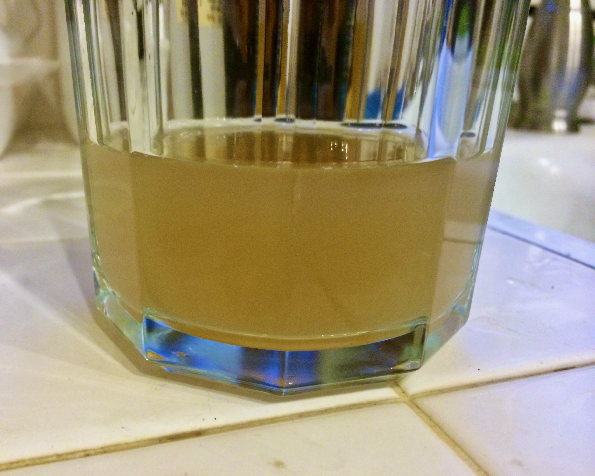
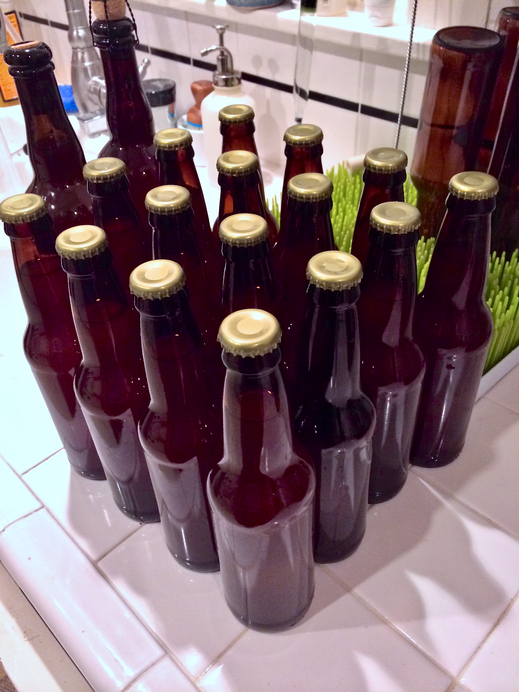

+++
title = "Nectarine Cider #1: Bottling Day!"
date = 2014-06-30

[taxonomies]
drink_types = ["cider"]
tags = ["nectarine cider #1", "bottling day"]
post_types = ["update"]
+++

Racked the top layer to bucket with 70g priming sugar + 4 oz water. Racked the rest to a 1g carboy
and added 1oz wildflower honey + 3oz water.

