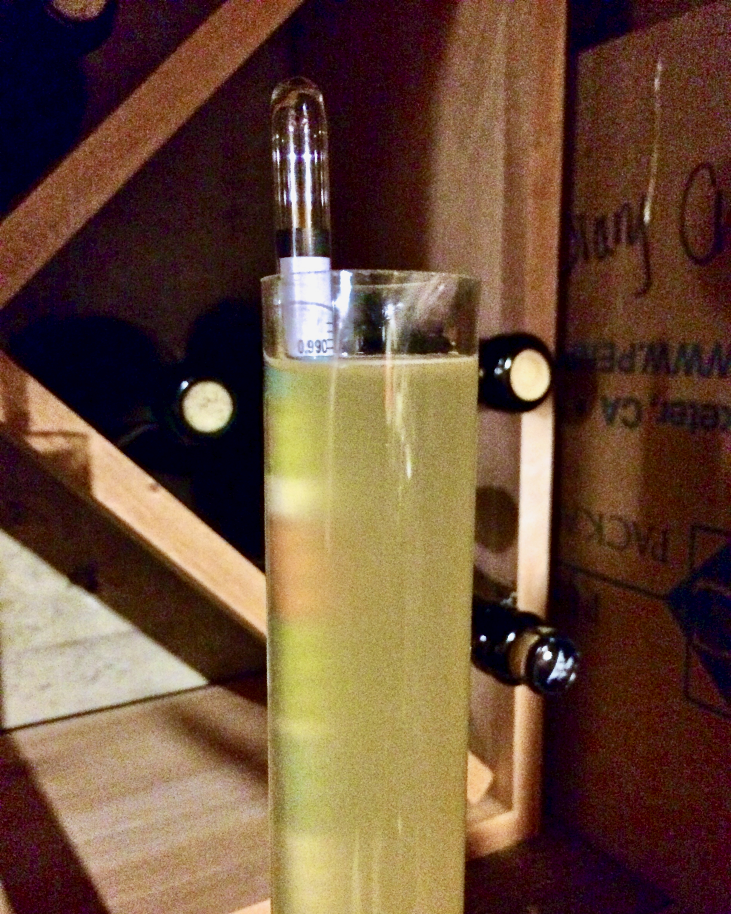
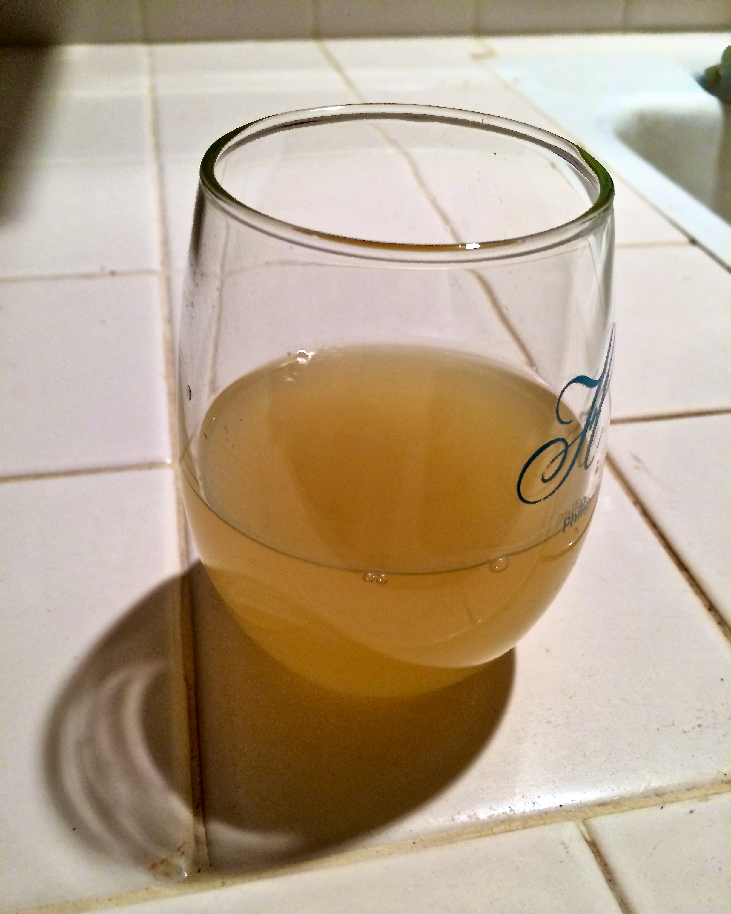

+++
title = "Peach Melomel #1: Update 2"
date = 2014-07-09

[taxonomies]
drink_types = ["mead"]
tags = ["peach melomel #1"]
post_types = ["update"]
+++

Just gravity readings tonight.

`SG: 0.990`.

