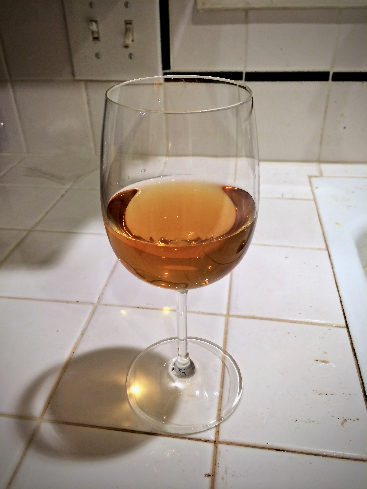

+++
title = "Tangerine Cherry Melomel #1: Tasting #1"
date = 2014-07-12

[taxonomies]
drink_types = ["mead"]
tags = ["tangerine cherry melomel #1", "tasting"]
post_types = ["update"]
+++

Popped a bottle. It was still a bit mysteriously flavored, although the orange and cherry were both
slightly evident in flavor.

Still a little harsh, but is certainly getting drinkable.

