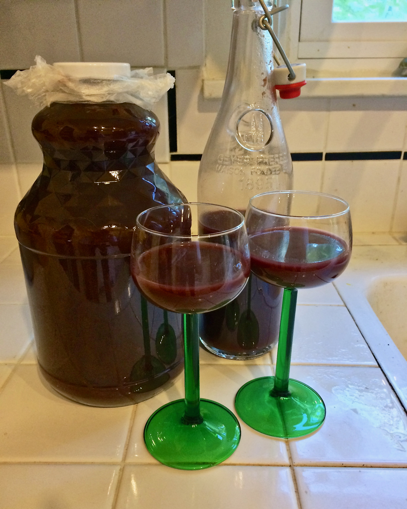

+++
title = "Cherry Cordial #1: Update 3"
date = 2014-07-13

[taxonomies]
drink_types = ["liqueur"]
tags = ["cherry cordial #1"]
post_types = ["update"]
+++

Into a 2L bottle, I…

Scooped off the fruit at the top of the fermenter and funneled it into the bottle. At about 2/3 the
way full, I scraped 2 vanilla beans, and added 1/3 cup white sugar (dissolved in hot water), then
added the vodka (maybe 2 cups worth?). Used a strainer and filled the rest of the bottle with the
cherry juice/mix. Stirred for about 2 minutes. Closed the top with some Press ‘N’ Seal and the cap
for the bottle and stuck it downstairs. Should age for maybe 3 months.

There was a bunch left in the fermenter, so I strained that and added it to a flip top. Got about
2/3 full. Tastes pretty good actually.

