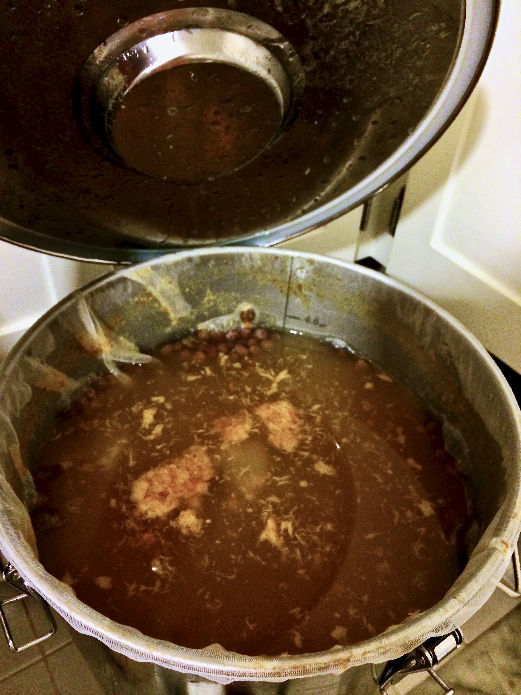
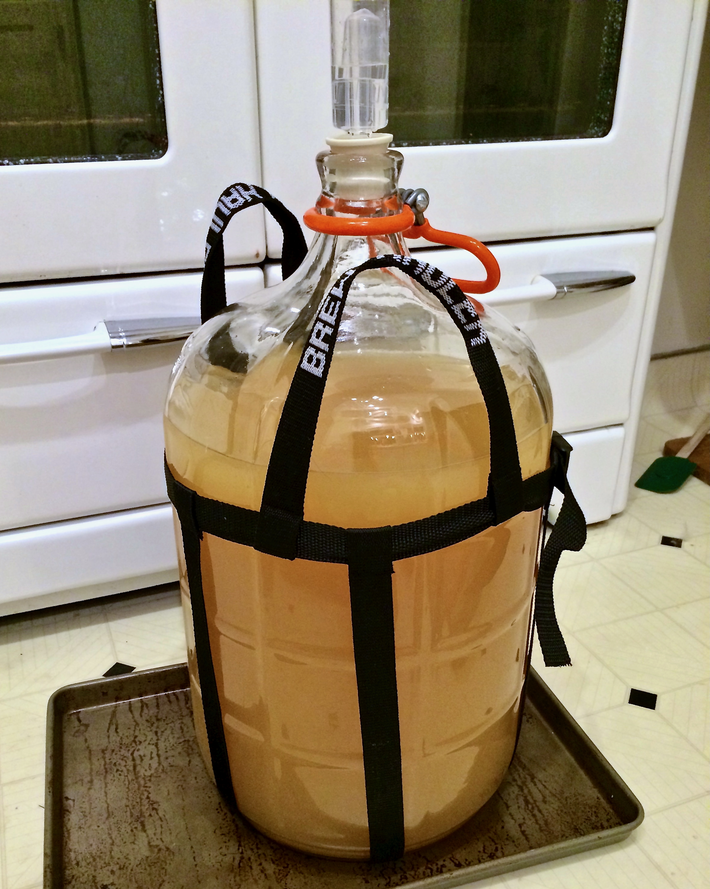

+++
title = "Peach Melomel #1: Update 3"
date = 2014-07-13

[taxonomies]
drink_types = ["mead"]
tags = ["peach melomel #1"]
post_types = ["update"]
+++

Racked to carboy. Looks like about 4G yield.

