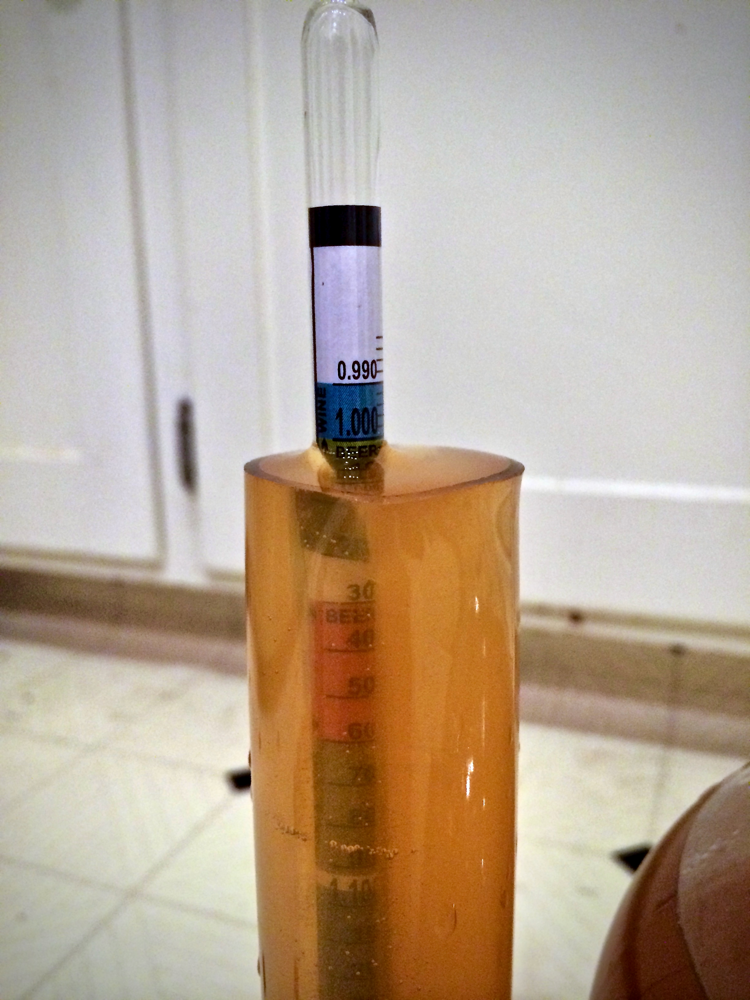

+++
title = "Strawberry Lavender Melomel #1: Update 13"
date = 2014-07-16

[taxonomies]
drink_types = ["mead"]
tags = ["strawberry lavender melomel #1"]
post_types = ["update"]
+++

Racked onto 1 teaspoon pectic enzyme (mixed with 1oz water). Tasted pretty strong of lavender, but
overall really good! Should mellow with age. `SG: 1.002`.

