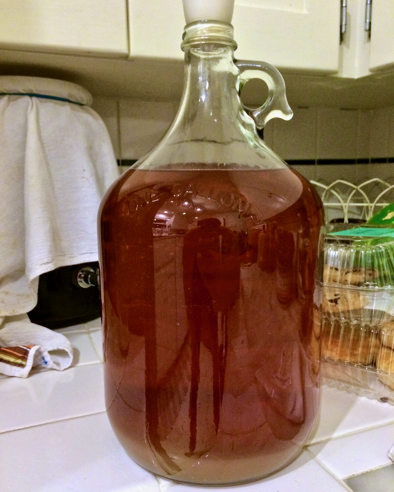
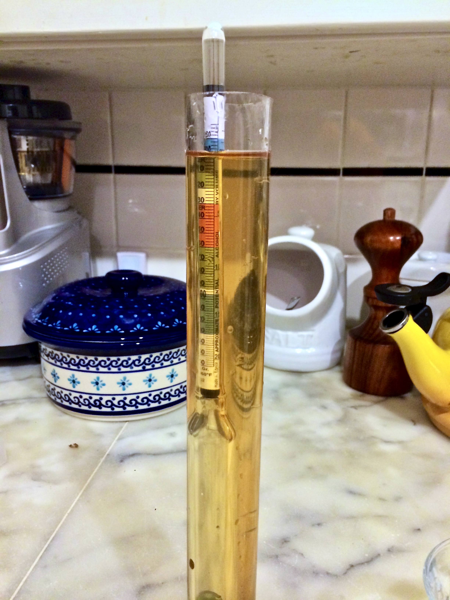
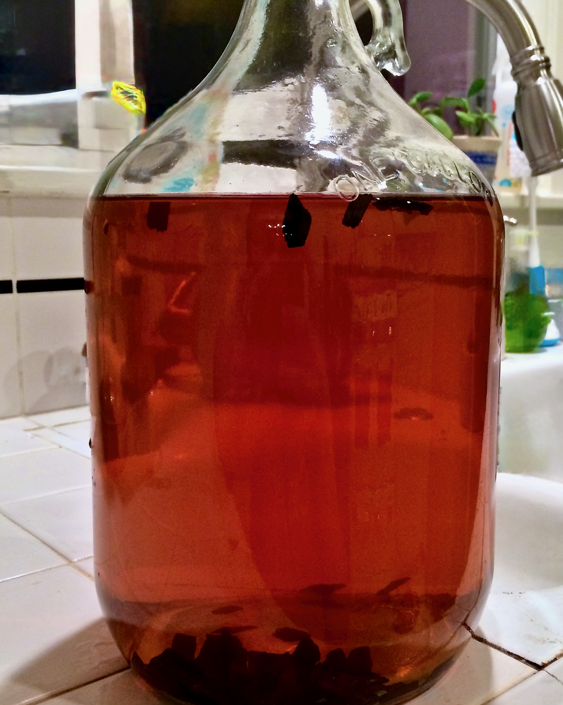

+++
title = "Strawberry Lavender Melomel #1: Update 14"
date = 2014-07-20

[taxonomies]
drink_types = ["mead"]
tags = ["strawberry lavender melomel #1"]
post_types = ["update"]
+++

Accidentally oaked this puppy!

There was a fair amount of lees, so I thought it was my current grape mead–didn’t realize till I
tasted this after racking it onto the oak chips. …So… Used 8g of chips. Boiled for about 4 mins,
then let sit for a bit. Added to the fresh carboy and racked the mead on top of it.
