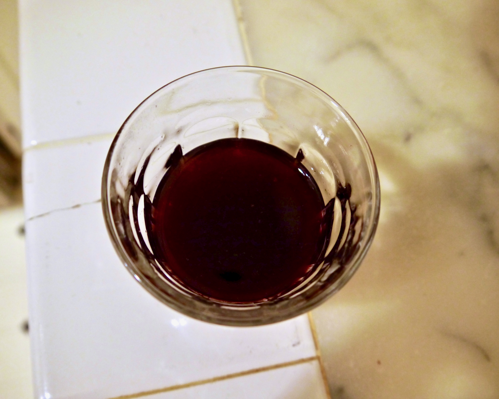
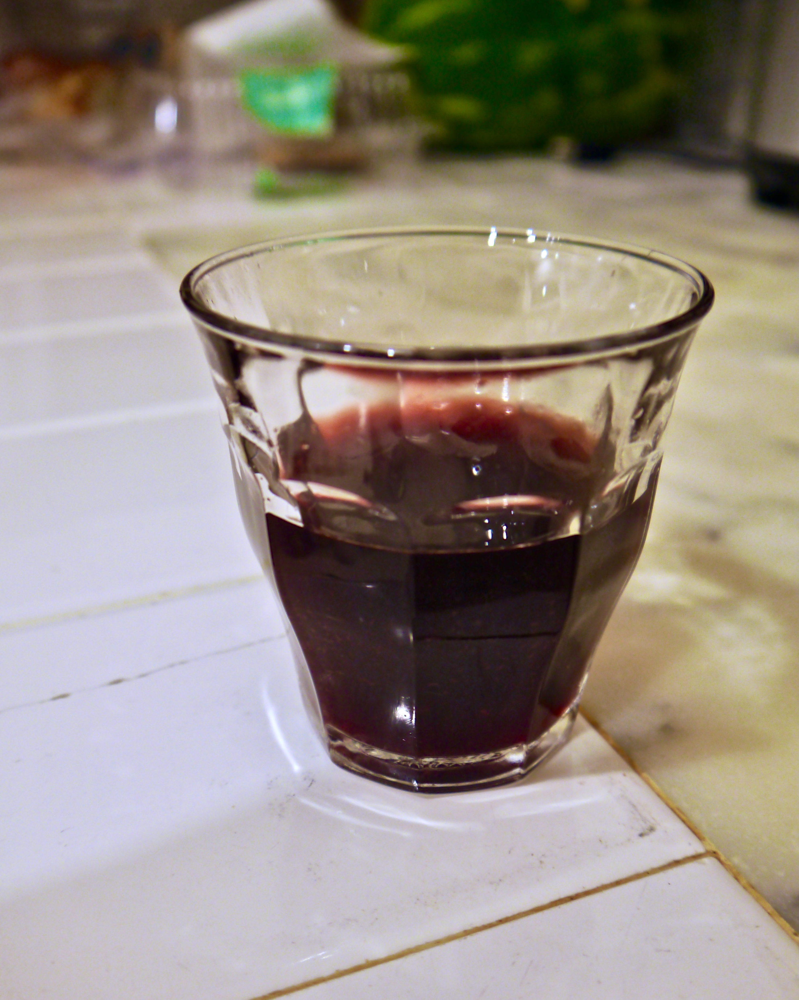

+++
title = "Cherry Cordial #1: Update 5"
date = 2014-07-23

[taxonomies]
drink_types = ["liqueur"]
tags = ["cherry cordial #1"]

post_types = ["update"]
+++

Had a taste from the stuff I put in the flippy. It’s actually turning out pretty tasty–not real
syrupy like I’d expect (I guess most liqueurs I’ve had have been syrupy?). I can still taste the raw
fruit a bit–i.e. it tastes like real fruit instead of cherry flavoring–yet it also tastes a little
wine-y or something.

