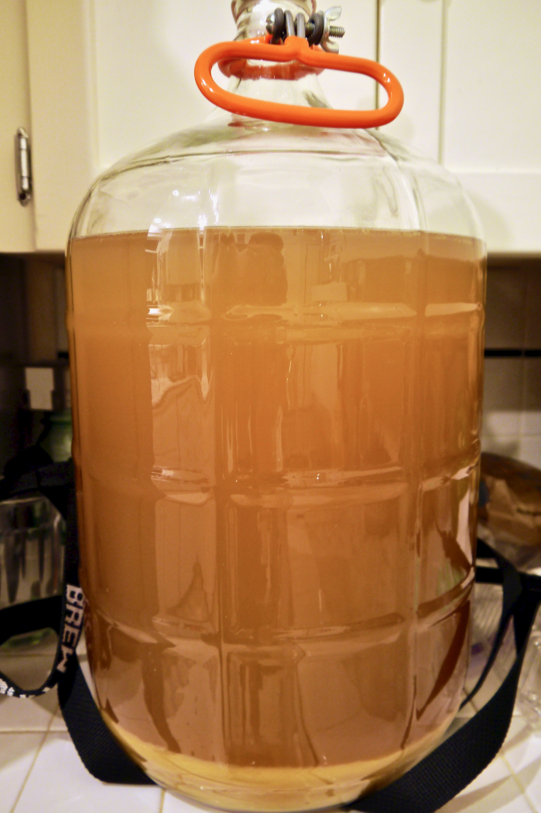
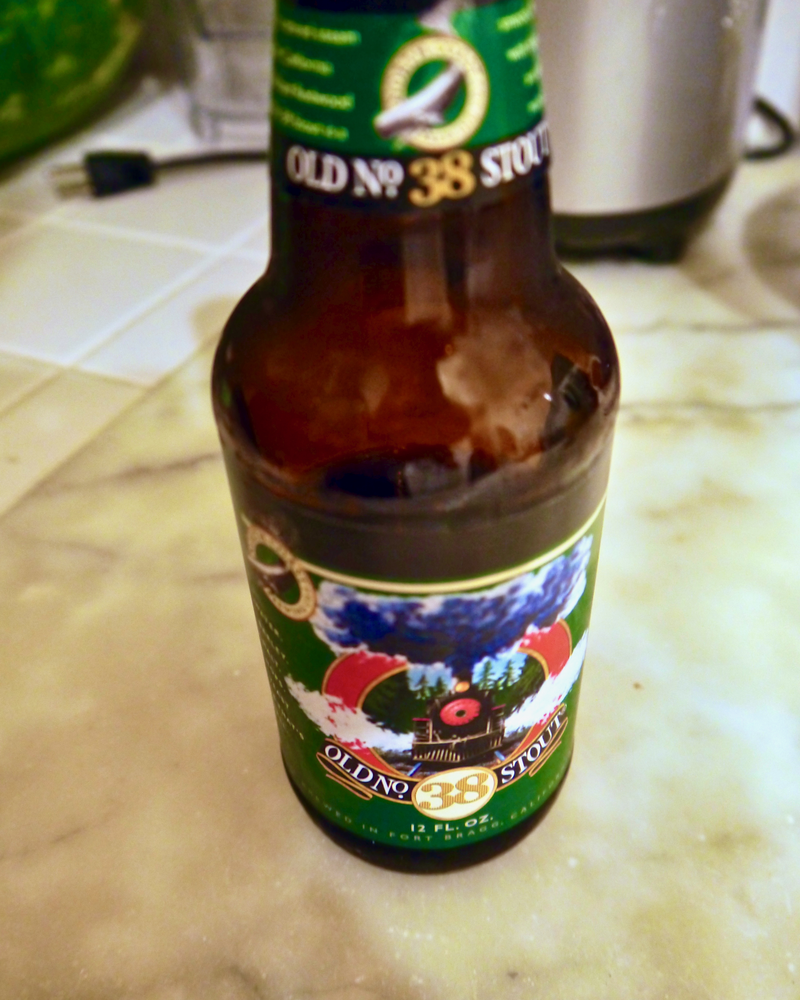
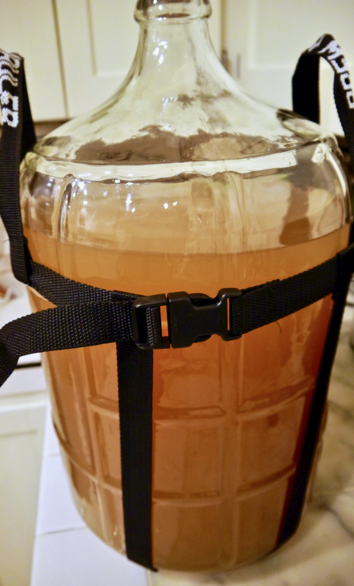

+++
title = "Peach Melomel #1: Update 4"
date = 2014-07-24

[taxonomies]
drink_types = ["mead"]
tags = ["peach melomel #1"]
post_types = ["update"]
+++

Racked off about 2″ of lees.

This kept me quenched during the process:

Honey fragrance and flavor are still pretty prominent. Overall it’s pretty light, easy, and sweet,
despite the low gravity. I’m tempted to add some vanilla–not just for flavor, but for some added
tannins–but am holding off en lieu of keeping things simple.

Post-rack:

