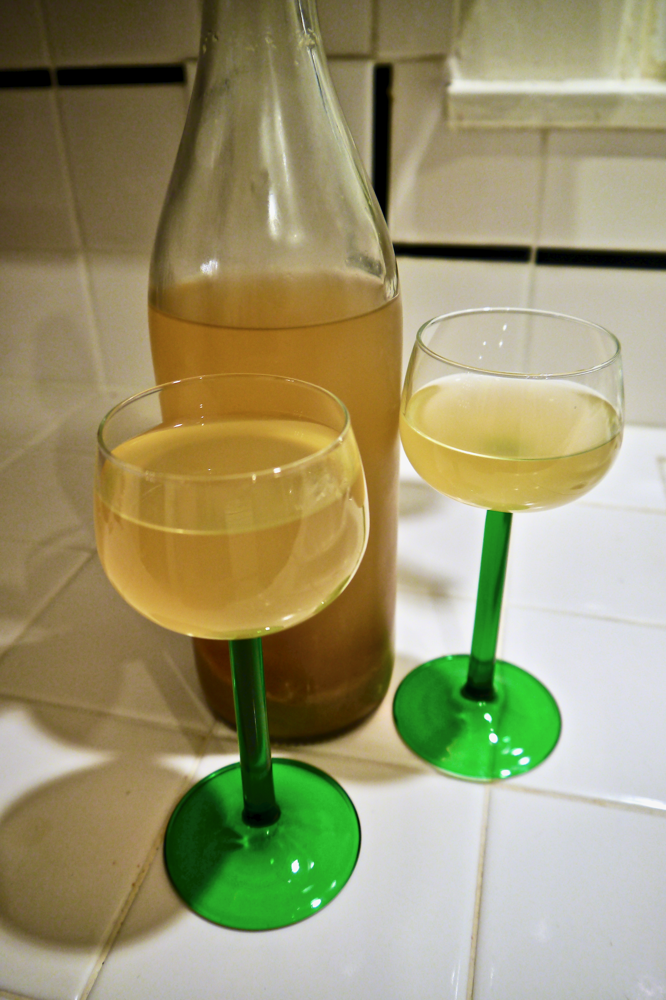
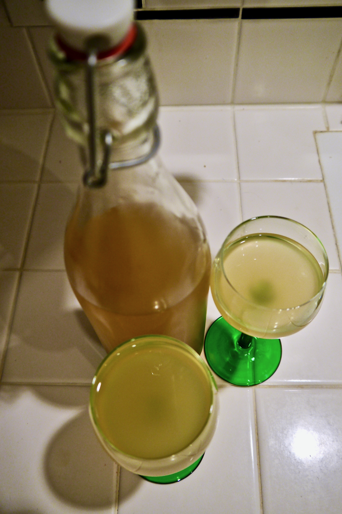

+++
title = "Peach Melomel #1: Tasting 1"
date = 2014-08-05T21:00:00

[taxonomies]
drink_types = ["mead"]
tags = ["peach melomel #1", "tasting"]
post_types = ["update"]
+++

I’m kinda bummed. I used all those peaches and the flavor here is completely dominated by the honey
fragrance and taste. Hoping it’ll even out over time.

