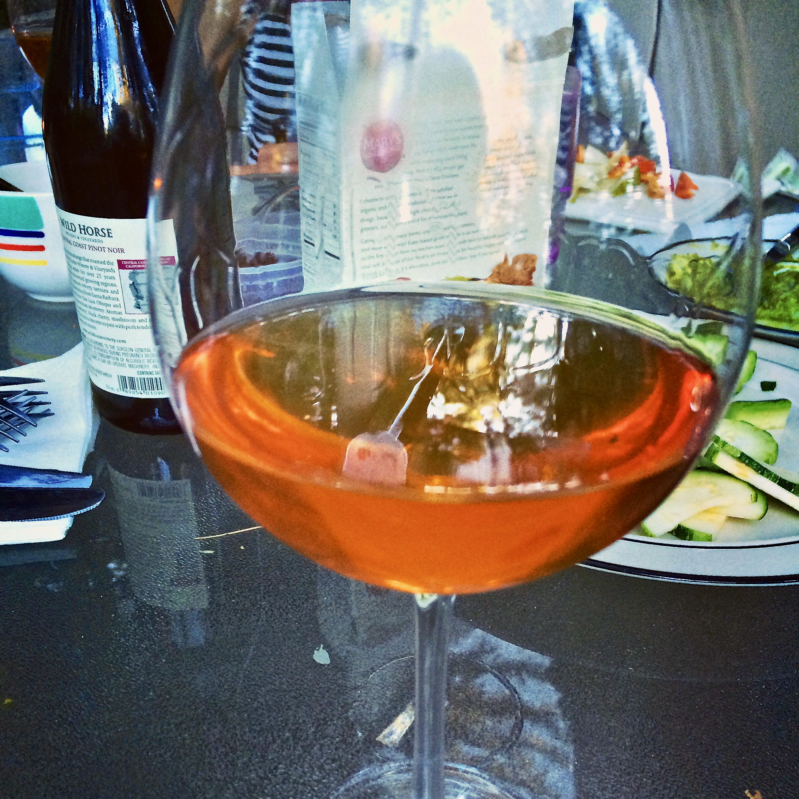

+++
title = "Tangerine Cherry Melomel #1: Tasting #2"
date = 2014-08-16

[taxonomies]
drink_types = ["mead"]
tags = ["tangerine cherry melomel #1", "tasting"]
post_types = ["update"]
+++

I cracked another bottle, this time with friends, and really dug how this has matured. It’s still
quite sweet, but the strong honey fragrance has dissipated a bit, leaving it feel a little more
balanced. You definitely get both the tangerine and the cherry, which I was afraid wouldn’t come
through. I’m pretty pleased and am looking forward to finishing off the last bottle.

