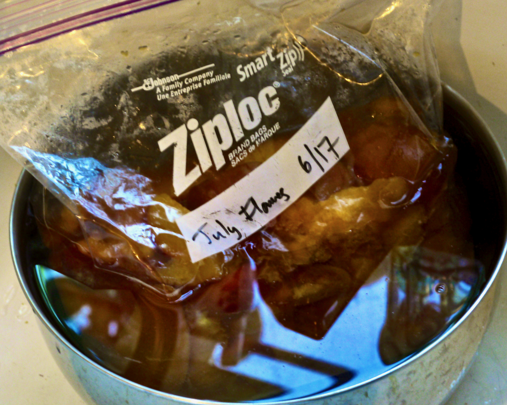
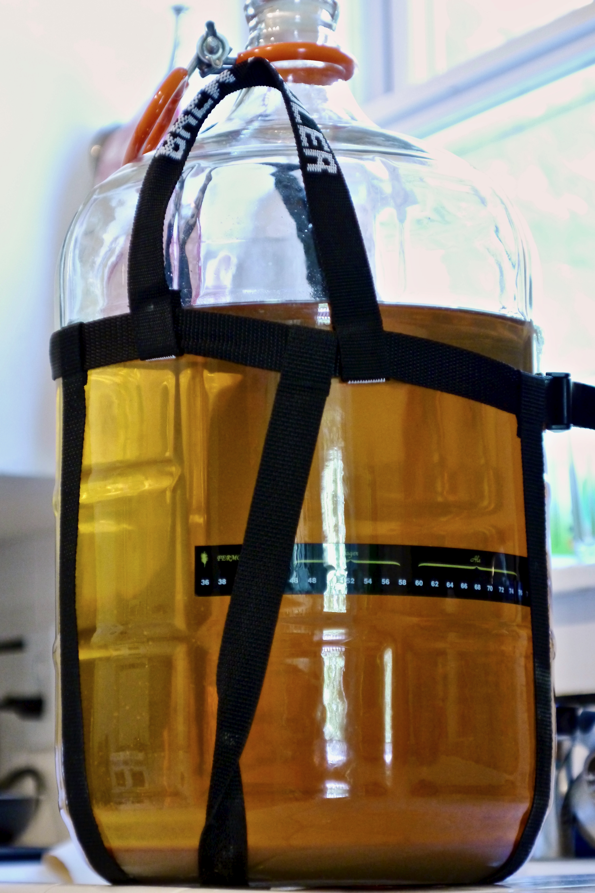

+++
title = "Peach Melomel #1: Update 6"
date = 2014-08-23

[taxonomies]
drink_types = ["mead"]
tags = ["peach melomel #1"]
post_types = ["update"]
+++

The sample I kept around from the last racking wasn’t peachy enough for me. Today, I pulled a 5lb
bag of July Flames out of the freezer, defrosted them (in a pot of hot water, in the sink), then
added them directly to the carboy (inside a 5G painters bag). Also sliced, scraped, and added 1
vanilla bean into the painters bag.

Lookin’ pretty tasty…

