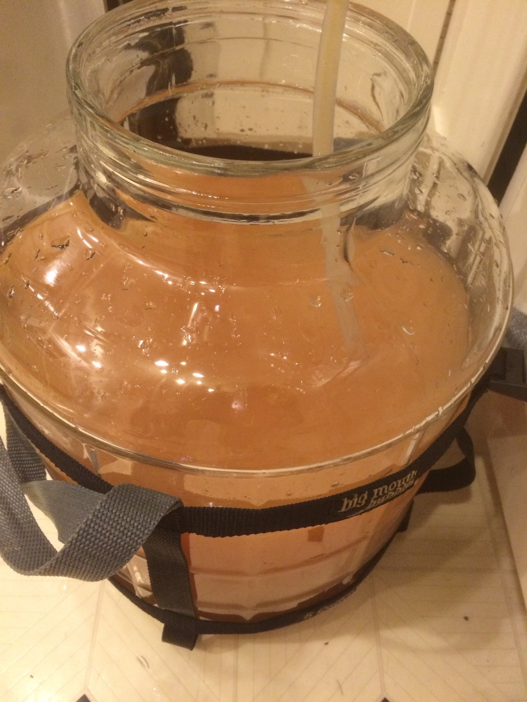

+++
title = "Mexican Lime Mead #1: Update 5"
date = 2016-02-28

[taxonomies]
drink_types = ["mead"]
tags = ["lime", "mexican lime mead #1"]
post_types = ["update"]
+++

Racked. SG: 1.052. Might be stuck?? Actually that's a lot of residual sweetness so that might be
just fine.

