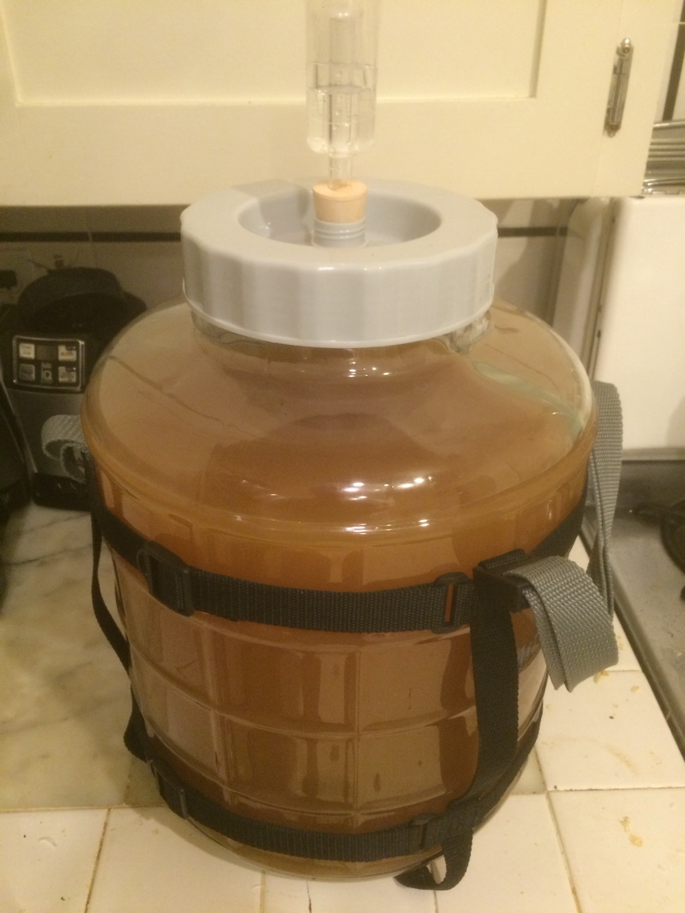
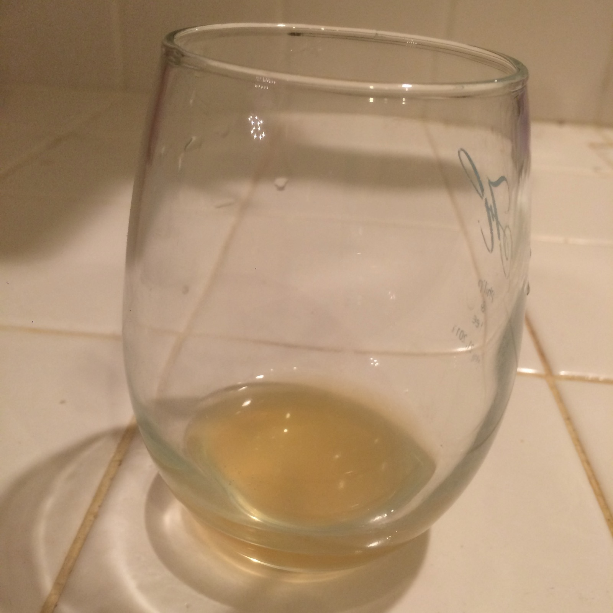

+++
title = "Mexican Lime Mead #1: Update 6"
date = 2016-05-04

[taxonomies]
drink_types = ["mead"]
tags = ["lime", "mexican lime mead #1"]
post_types = ["update"]
+++

Racked. Pretty dang tart! But gets the mouth juices flowing pretty well. Assuming it ages out some
of the alcohol bite, this will be good with some bubbles. Still pretty cloudy though. Definitely
thinking about using some Sparkaloid with this one. SG: 1.046 (7.09%). Topped off with Private
Reserve wine preserver. Wanted to add some raisins for nutrients but we’re out. :-/

