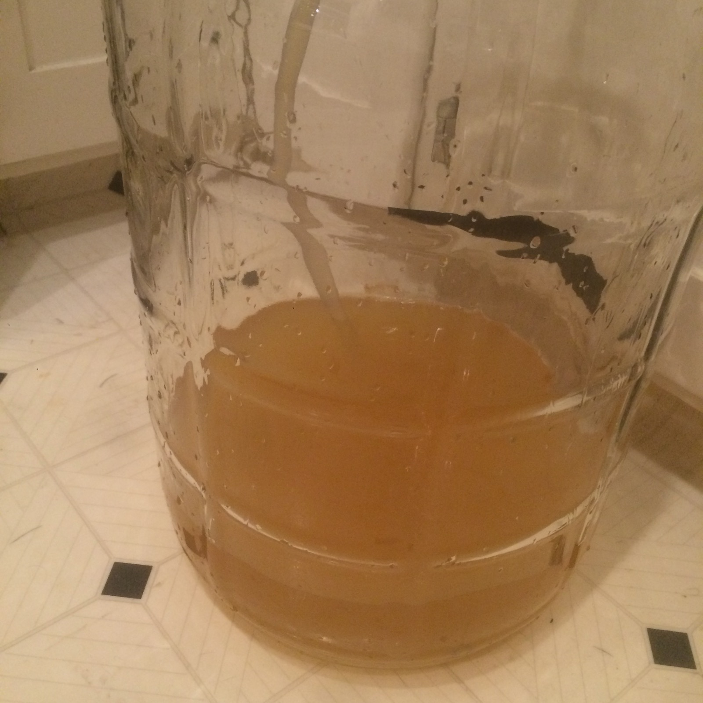
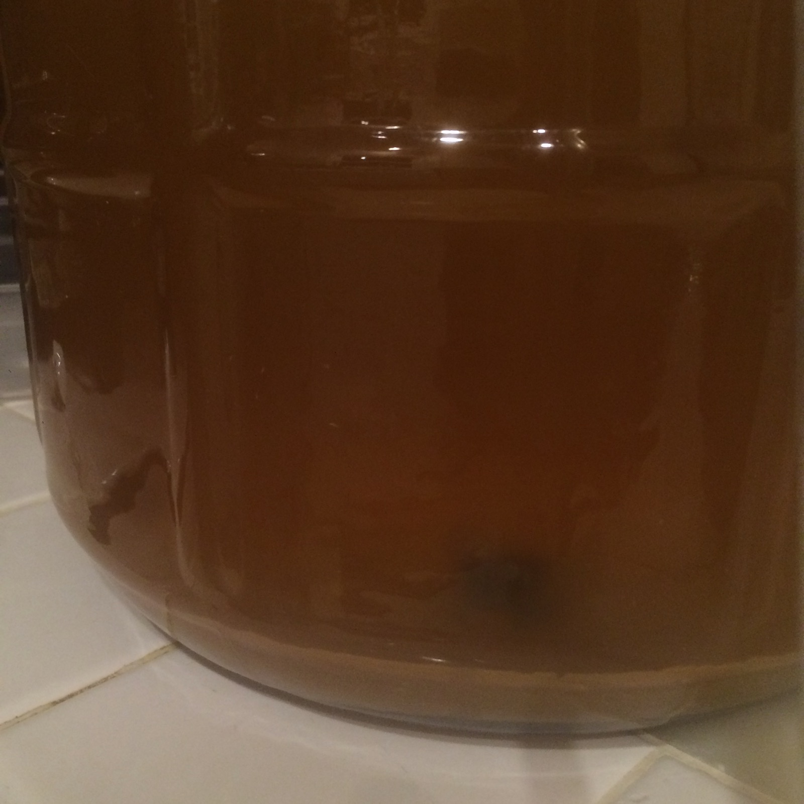

+++
title = "Pumpkin Black Tea Mead #1: Update 4"
date = 2016-07-14

[taxonomies]
drink_types = ["mead"]
tags = ["pumpkin", "pumpkin black tea mead #1"]
post_types = ["update"]
+++

Racked. Should note that this ferment went for a loooong time. I think I saw bubbling in the airlock
as late as June. This yeast def seems like a slow fermenter. Topped with Private Preserve.

