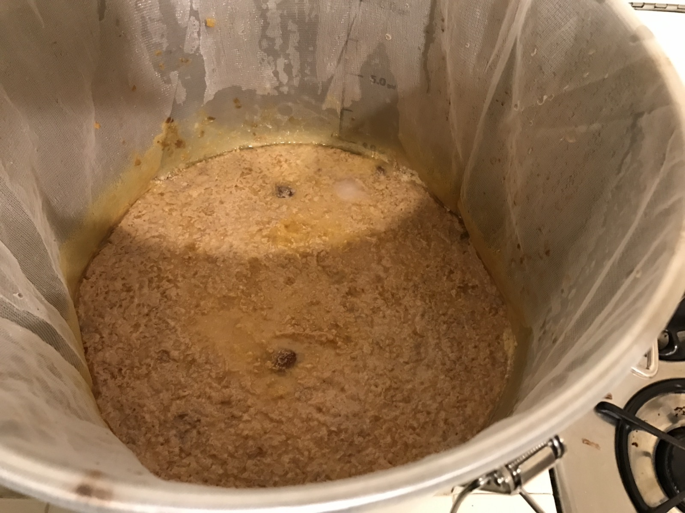
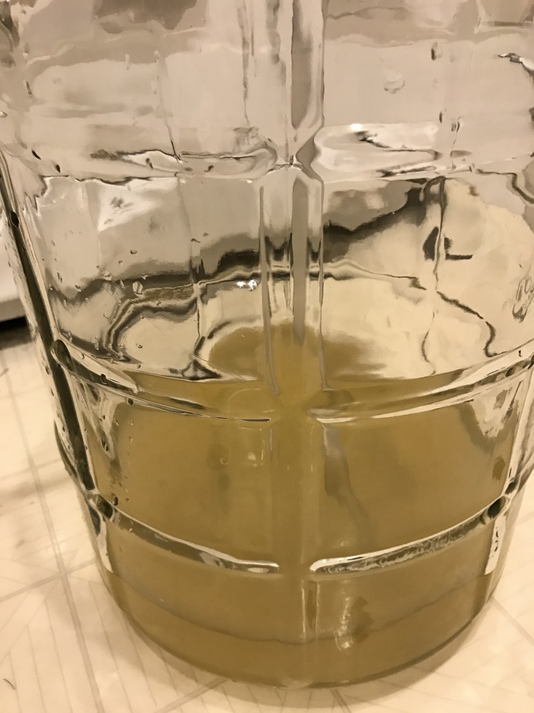
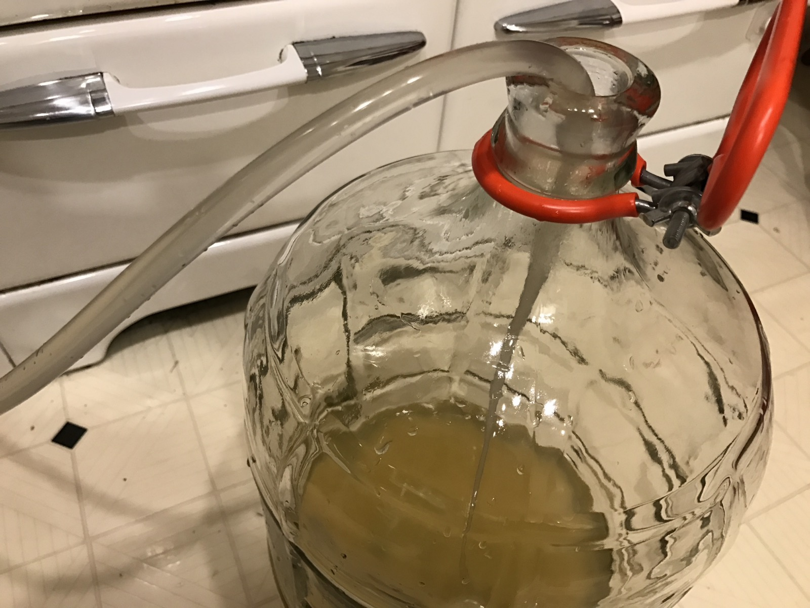
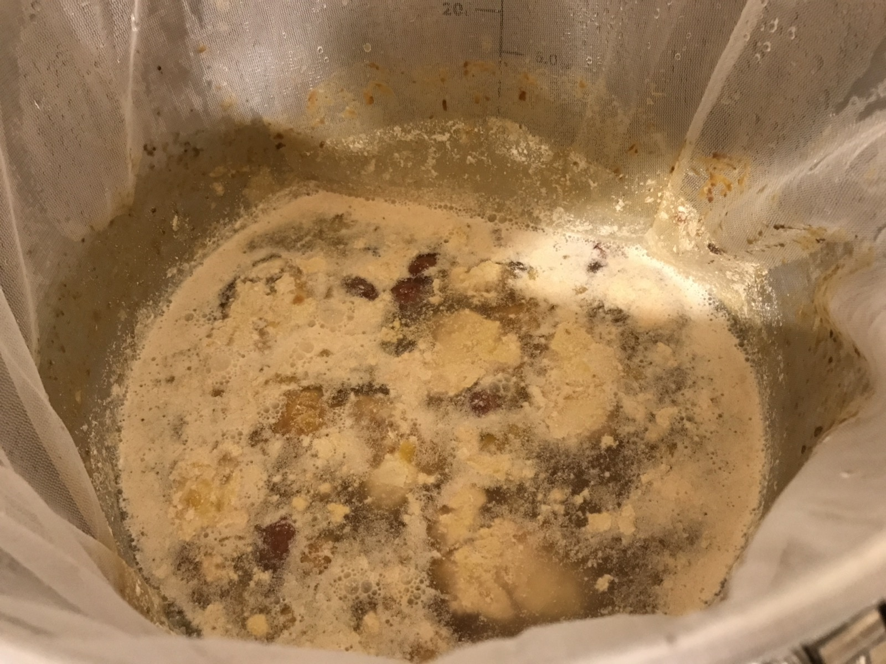
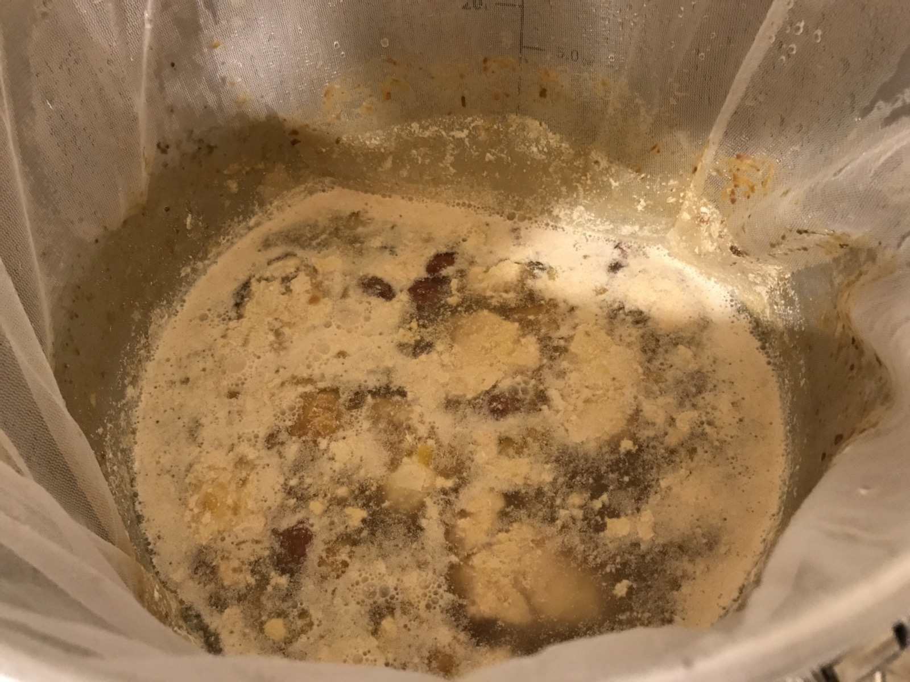
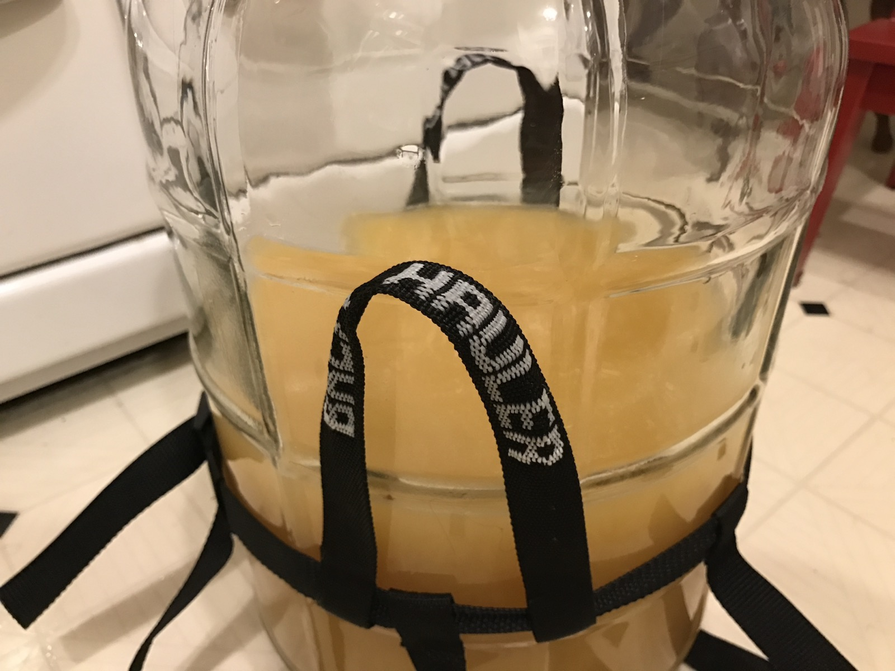
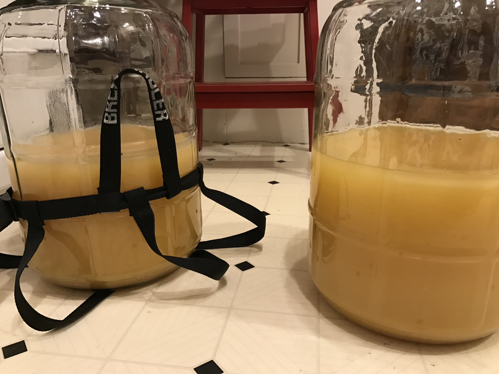
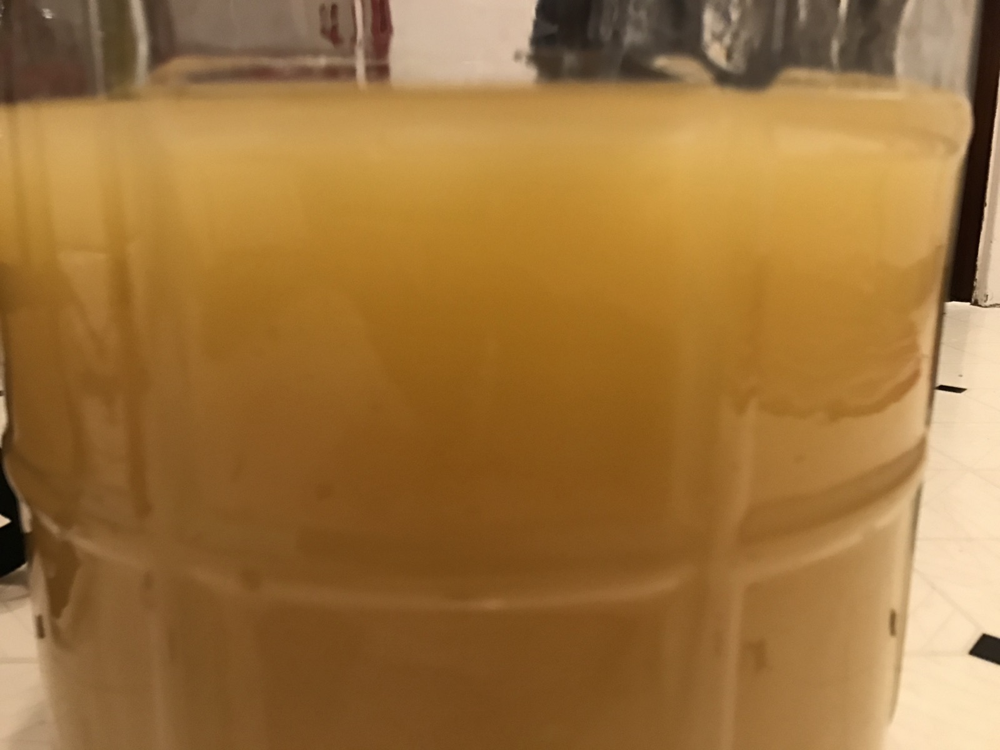
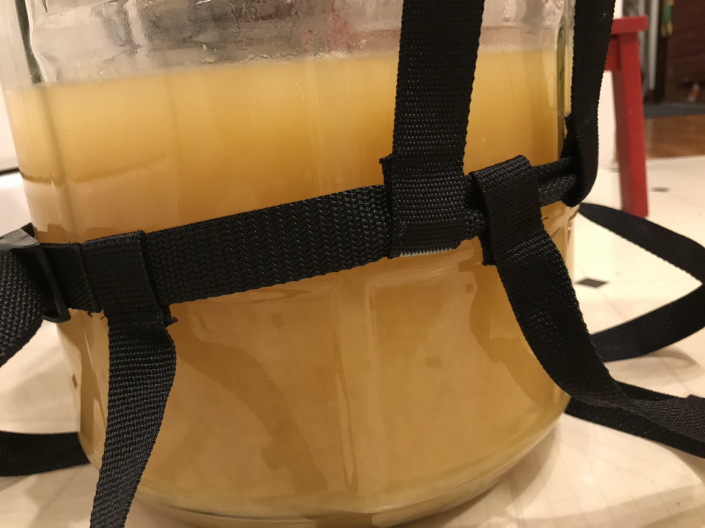
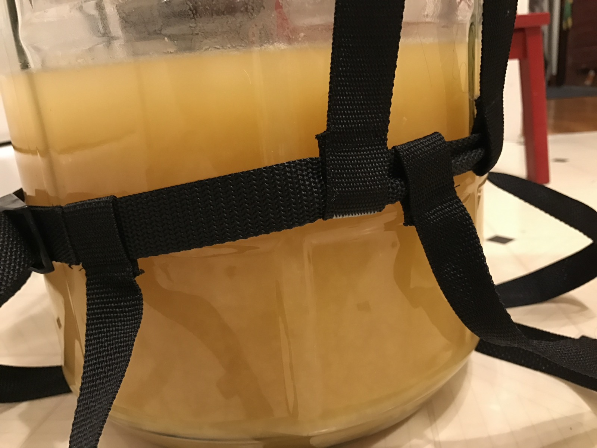

+++
title = "Peach Ciderwine Experiment #1: Update 4"
date = 2016-11-10

[taxonomies]
drink_types = ["cider"]
tags = ["peach", "peach ciderwine experiment #1"]
post_types = ["update"]
+++

Finally racked to carboys.

First the control.

Then the ClO2

