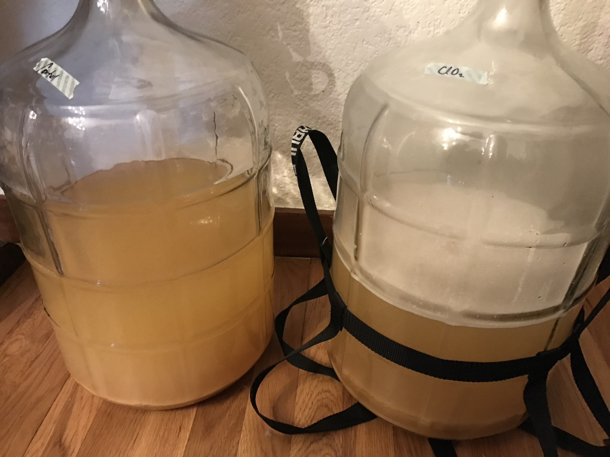

+++
title = "Peach Ciderwine Experiment #1: Update 5"
date = 2016-11-12

[taxonomies]
drink_types = ["cider"]
tags = ["peach", "peach ciderwine experiment #1"]
post_types = ["update"]
+++

ClO2 has lots of white on top; control does not

