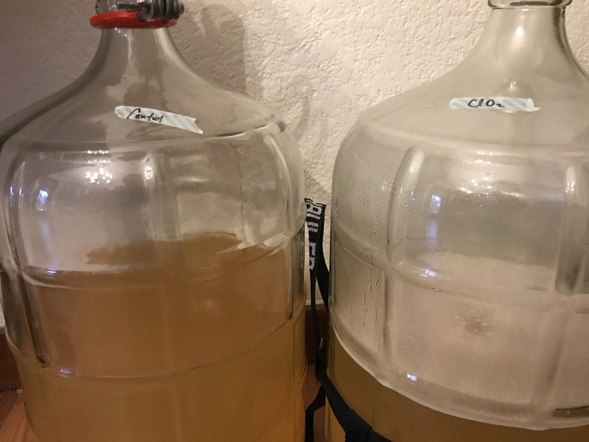
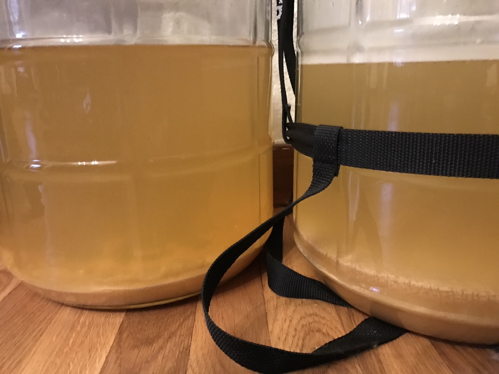
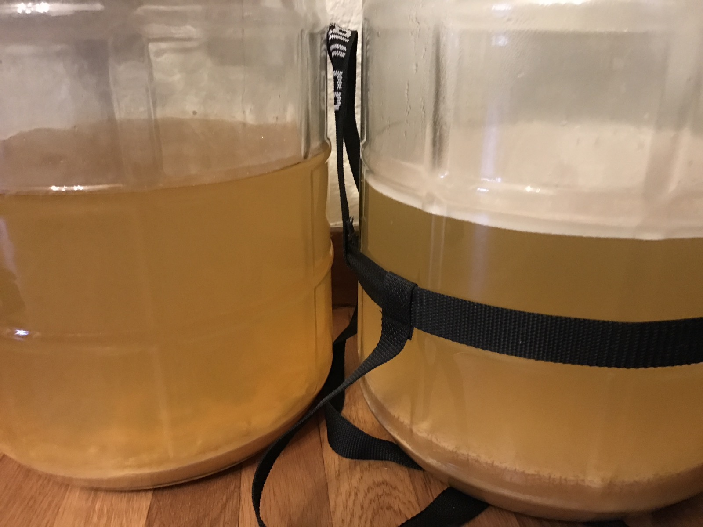

+++
title = "Peach Ciderwine Experiment #1: Bottling Day!"
date = 2016-12-12

[taxonomies]
drink_types = ["cider"]
tags = ["peach", "peach ciderwine experiment #1"]
post_types = ["update"]
+++

Still the ClO2 has lots of white stuff on top; the control does not.

Going to use plain ol corn sugar for both. There’s a little more overall volume to the control, but
less sediment, so I’m gonna say the control is about 2.5G, whereas the ClO2 is about 2G. I’m going
to aim for 3.3 gravities, meaning

- control: 94.19 grams
- ClO2: 75.35

Bottled:

- Control, green caps: 12 12oz bottles, 7 22oz bottles
- ClO2, orange caps: 12 12oz bottles, 4 + 1/2 22oz bottles
