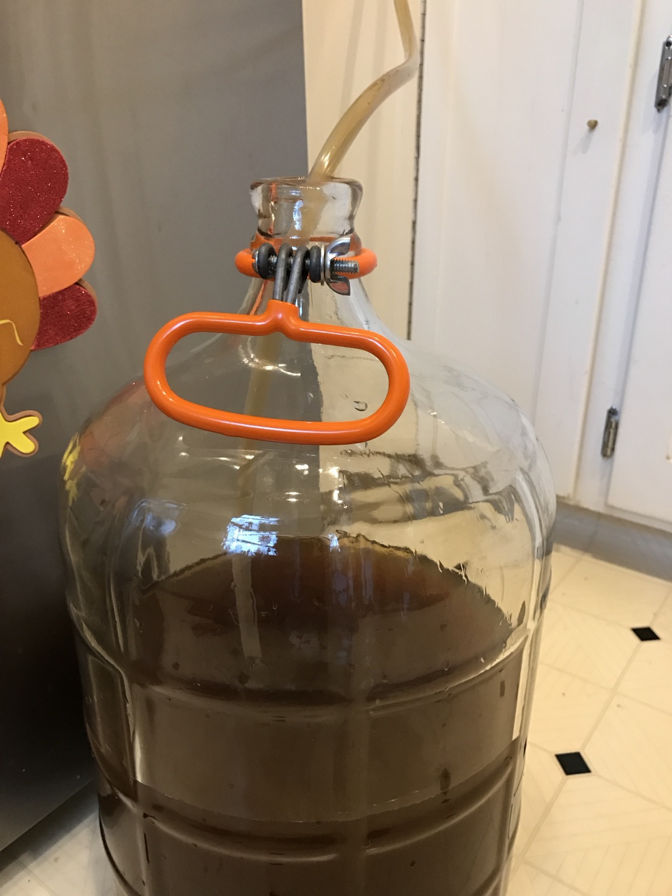

+++
title = "Mexican Lime Mead #1: Update 8"
date = 2016-12-30

[taxonomies]
drink_types = ["mead"]
tags = ["lime", "mexican lime mead #1"]
post_types = ["update"]
+++

Racked onto 2.5 teaspoons of pectic enzyme. Almost a full inch of sediment. Still relatively opaque,
hence the pectic enzyme. Tastes a bit more mild now, but still quite tart. I think this could be
drinkable soon.

