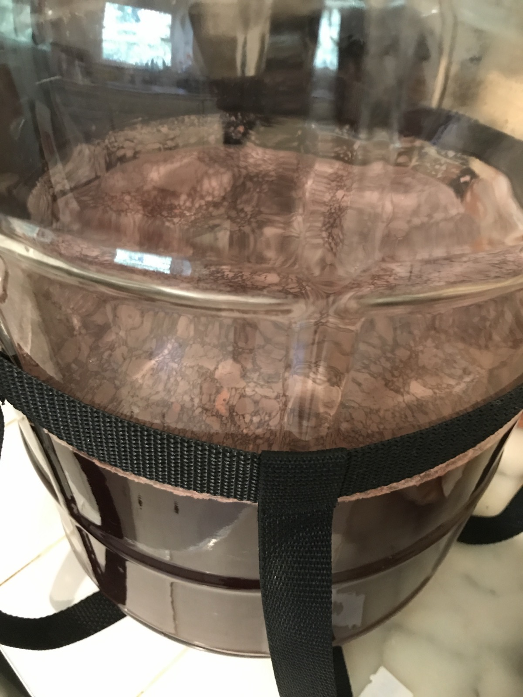
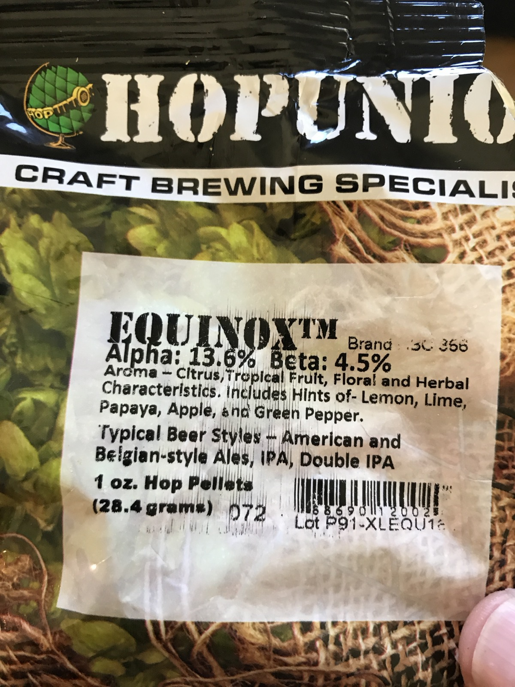

+++
title = "Just Oranges #1: Bottling Day!"
date = 2017-08-13

[taxonomies]
drink_types = ["wine"]
tags = ["orange", "just oranges #1"]
post_types = ["update"]
+++

FG: 0.994

About 2 G must.

83g dextrose mixed in 1/2c hot water, stirred.

Dry hopped with 1 oz Hopunion Equinox pellets

16 bottles: 6 22oz, 10 12oz

