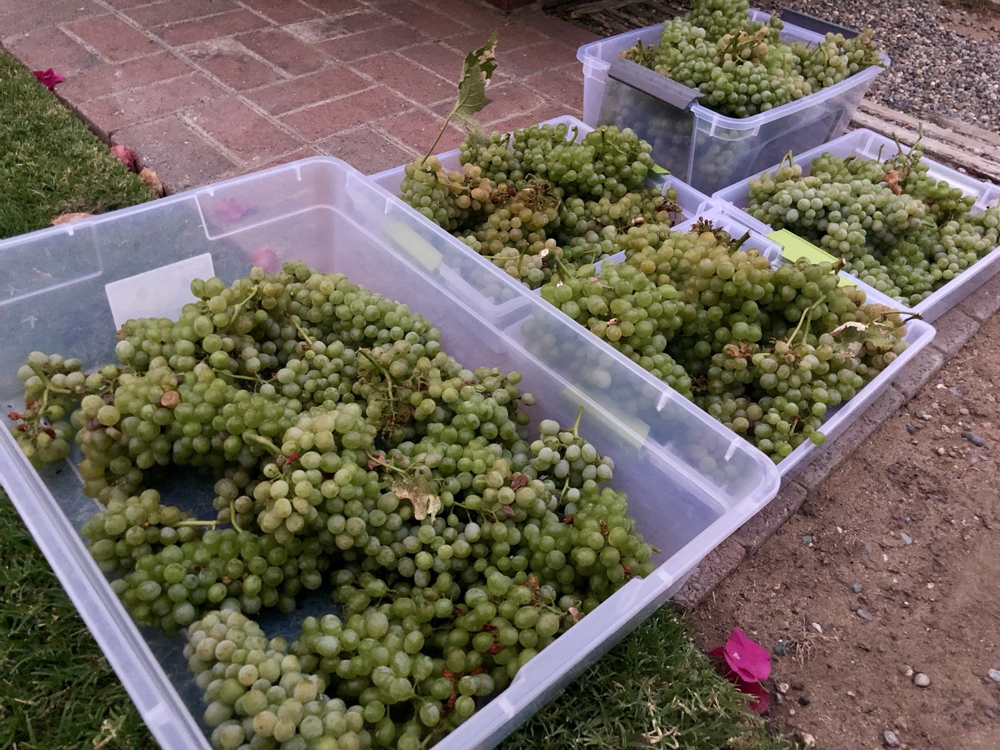
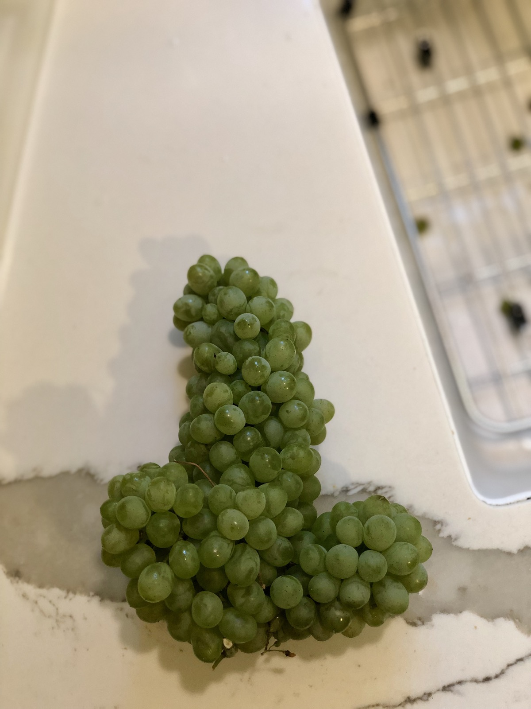
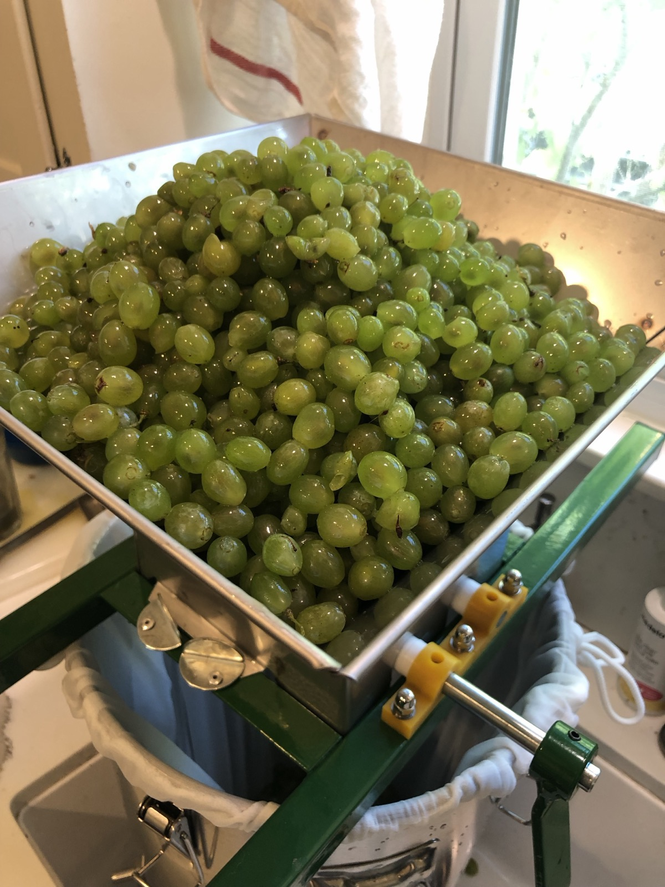

+++
title = "Chenin Blanc #2"
date = 2019-08-18

[taxonomies]
drink_types = ["wine"]
tags = ["chenin blanc", "grapes", "chenin blanc #2"]
post_types = ["start"]
+++

Picked at night, 8/17/19.

- Destemmed.
- Crushed. Done at 4:00pm. By volume, there are 4 gallons of grapes in the fermenter.
- Let sit in front of AC vent till 9pm. Temp got down to 68F (used SS brew tech thing with
  thermometer). Didn’t sulfite the crush.
- Pressed out about 2 gallons. Probably pressed too much
- Brix at 20. :(
- TA test shows .60%. Adding 2tsp to bring up to .75%.
- SG = 1.084 (also = 20 Brix, verifying the refractometer reading).
- Added 1 lb dextrose (corn sugar) to bring to 24 Brix.
- Tastes great! Super sweet and nice tartness
- Added 2tsp yeast nutrient
- Added 1tsp pectic enzyme
- Added 2 campden tablets

