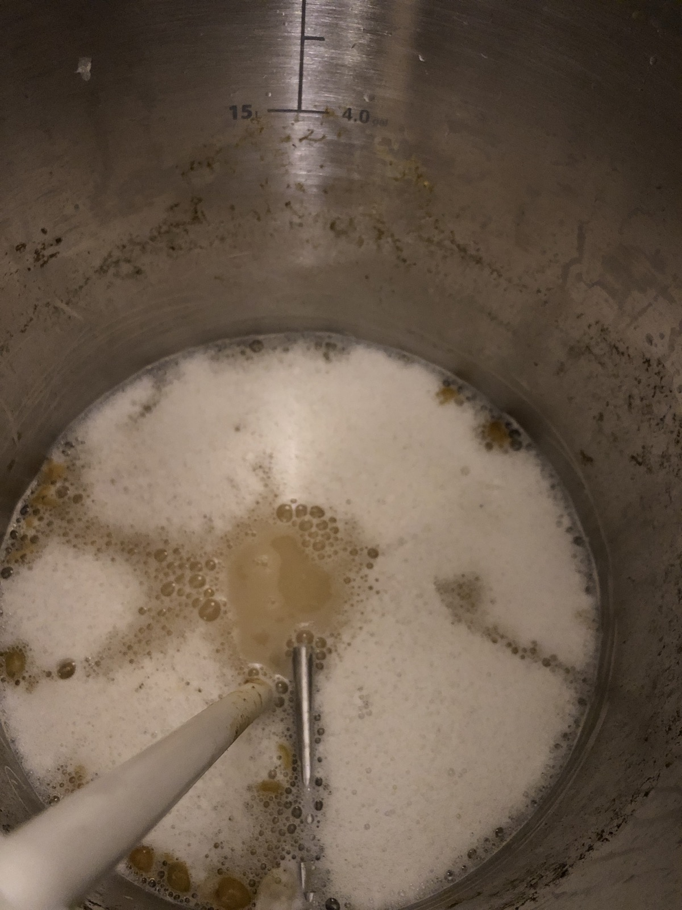
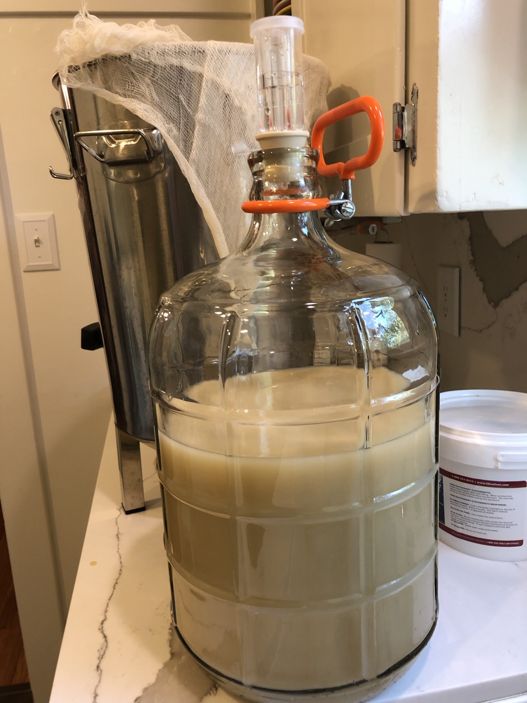

+++
title = "Chenin Blanc #2: Update 4"
date = 2019-08-22

[taxonomies]
drink_types = ["wine"]
tags = ["chenin blanc", "chenin blanc #2"]
post_types = ["update"]
+++

- 7:45: 76.8F
- SG: 1.008 (!)
- 9:39: 78.3F. Racked

