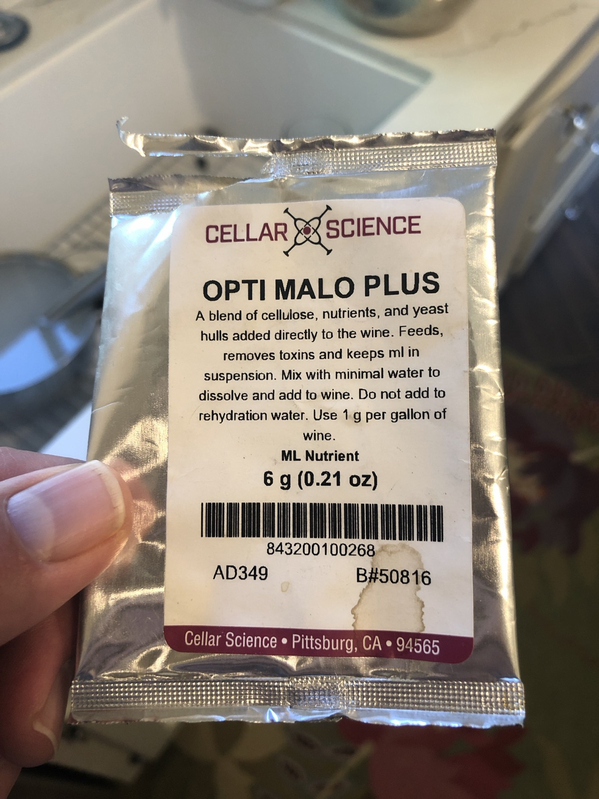

+++
title = "Pink Lady Cider #3"
date = 2019-09-02

[taxonomies]
drink_types = ["cider"]
tags = ["apple", "pink lady", "recipe", "pink lady cider #3"]
post_types = ["start"]
+++

## Ingredients

- ~17lbs Organic Pink Ladies from Costco
- Pectic enzyme
- Campden tabs
- Yeast nutrient
- Lalvin K1V-1116
- Cellar Science Opti Mali Plus Malolactic starter

(Labor Day) Used Peter’s crusher to crush. Then put in bag and pressed in his press. Took two rounds
to press since I got the wrong size bag. I used the masticating juicer to juice 1 liter of juice—it
was definitely a bit more cloudy and astringent. The juice from the press was sweeter and clearer
than those I’ve done in the past.

Put 2 campden tabs, 1.0t pectic enzyme, 1.0t yeast nutrient. Covered fermentor with a towel.

SG: 1.050?
