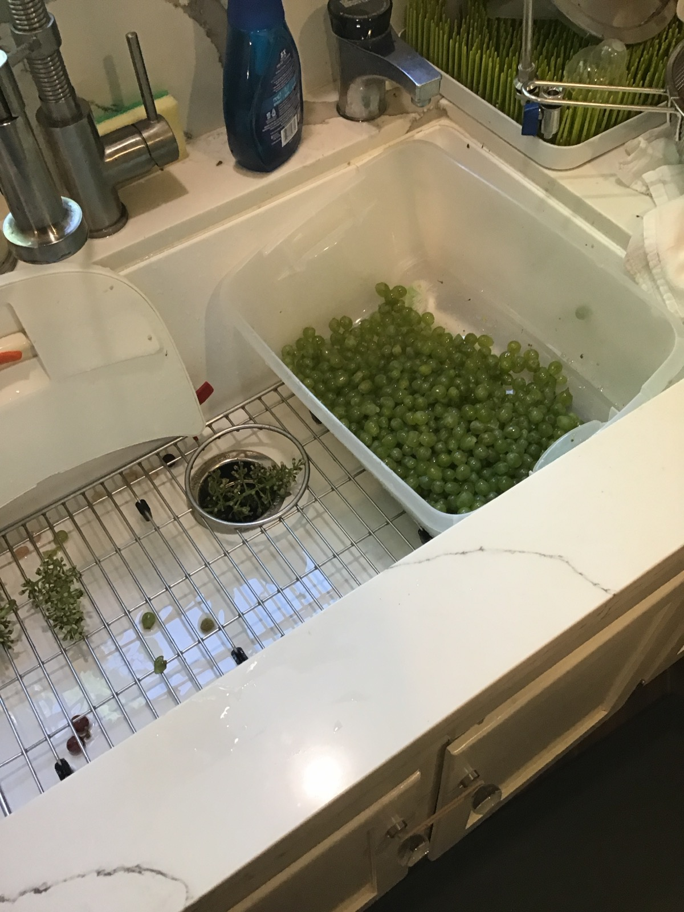
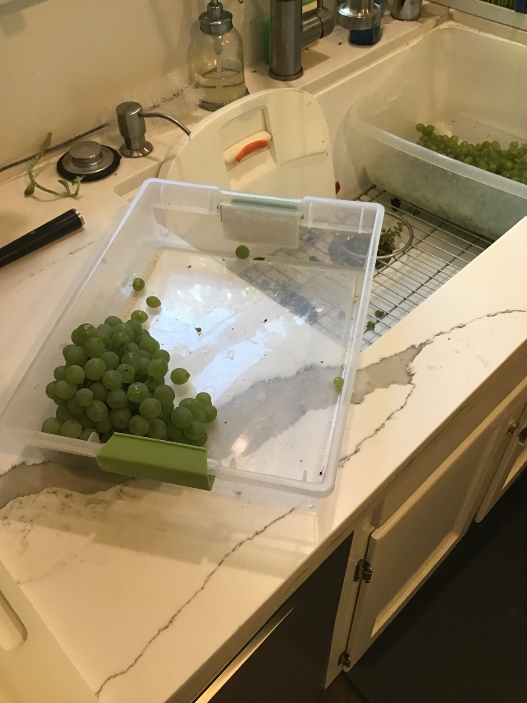

+++
title = "Chenin Blanc #3"
date = 2020-07-26

[taxonomies]
drink_types = ["wine"]
tags = ["chenin blanc", "grapes", "chenin blanc #3"]
post_types = ["start"]
+++

Picking 11:00am, 7/26

Brix at 21.5-22, but flavor is really nice. Juicy, some complexity.

16lbs.

Hand crushed at 9pm in the Big Mouth Bubbler. Covered with a towel and set next to the AC vent.
