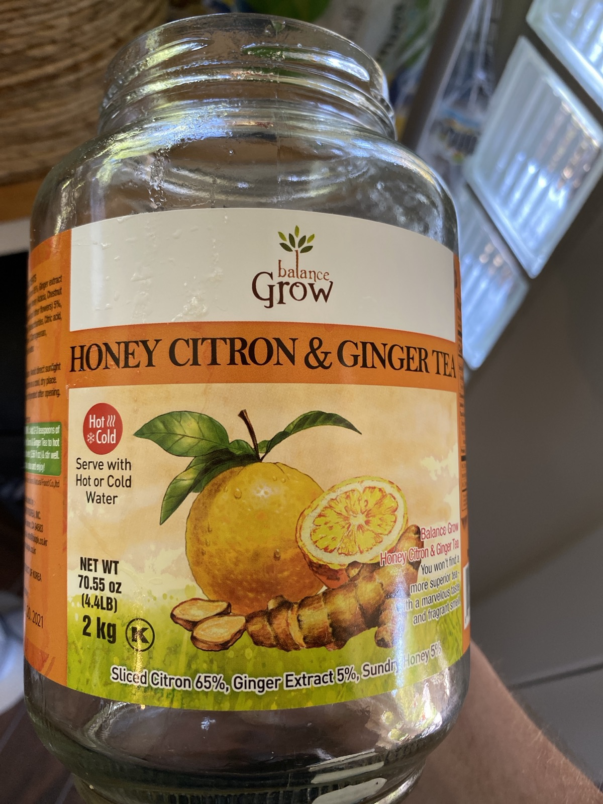
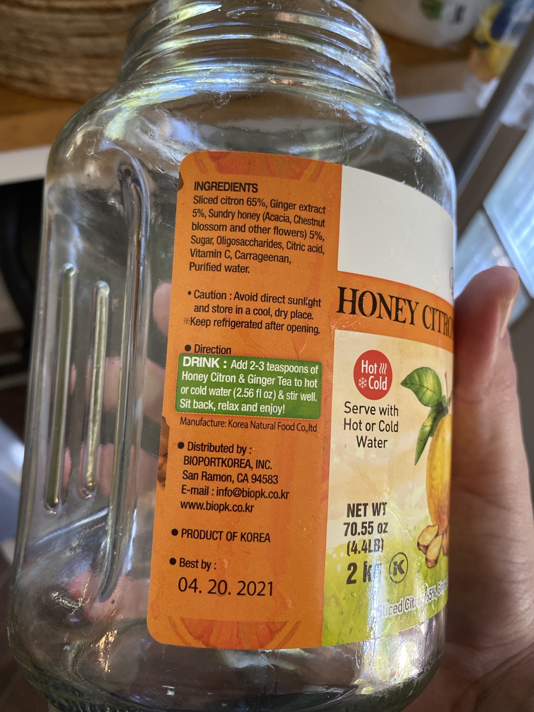

+++
title = "Honey Citron and Ginger Tea Mead #1"
date = 2020-08-14

[taxonomies]
drink_types = ["mead"]
tags = ["honey", "citron", "ginger", "tea", "recipe", "honey citron and ginger tea mead #1"]
post_types = ["start"]
+++

Dissolved in a bit of hot water. Added to Brew Bucket and brought to about 2.5G. Tastes pretty good.

- 1t pectin enzyme
- 2t yeast nutrient
- Lalvin K1-V1116 (pitched at 10:40pm)

Brew bucket lid is on but no air lock; just a towel. OG: 1.054
