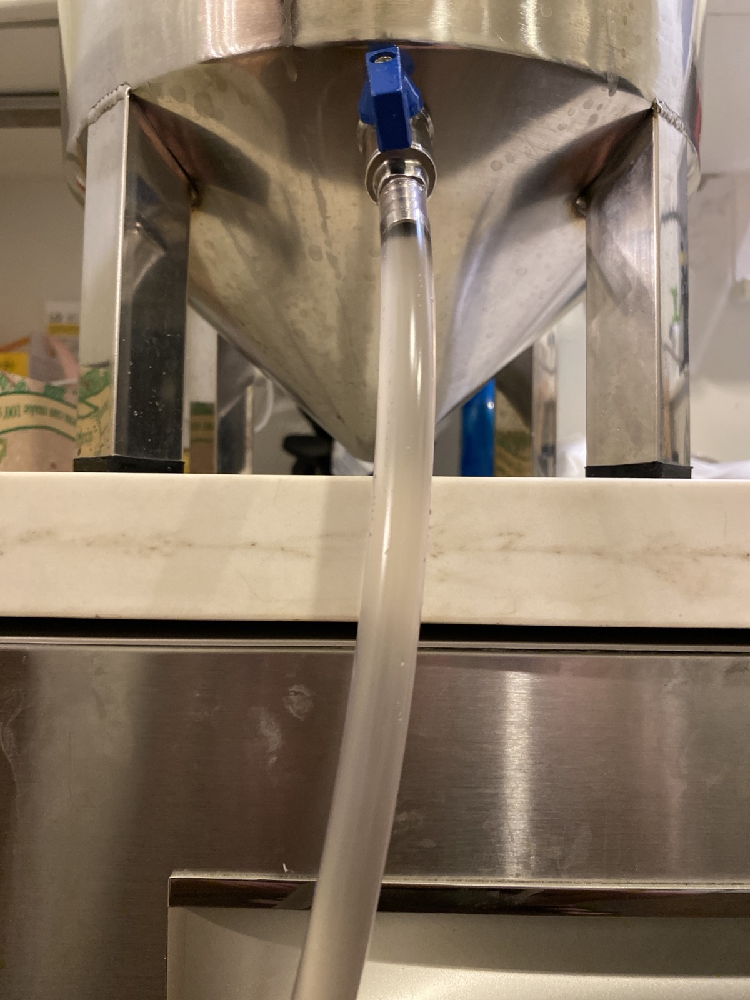
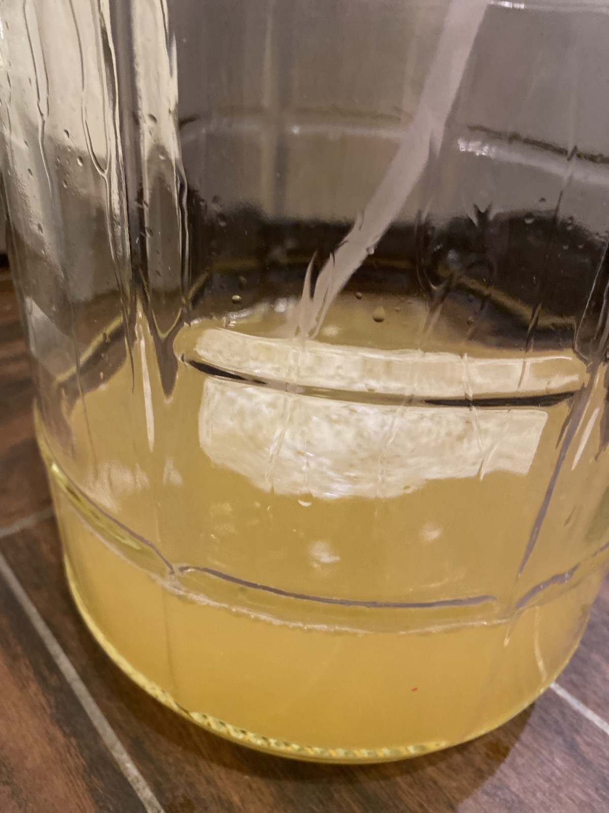

+++
title = "Apple Pineapple Mead #1: Update 3"
date = 2020-09-07

[taxonomies]
drink_types = ["mead"]
tags = ["apple", "pineapple", "apple pineapple mead #1"]
post_types = ["update"]
+++

Doesn’t look like it’s fermenting anymore. Racking. Temp looks like it’s been 69-73.

Tastes the dregs from the last rack (from fridge)—it was pretty good.
