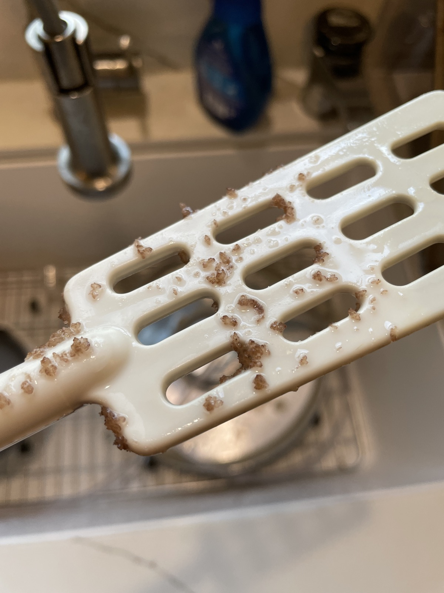

+++
title = "Grape Mead #1: Update 2"
date = 2021-12-26

[taxonomies]
drink_types = ["mead"]
tags = ["grapes", "grape mead #1"]
post_types = ["update"]
+++

Finally racked to carboy. This is embarrassing that it took so long. Hoping it’s ok. Pretty much a
full 3 gallons. Interestingly there was some salt-like stuff attached to the mixing spoon I’d left
in there

Also odd that the lees/yeast cake actually smells pretty good.
